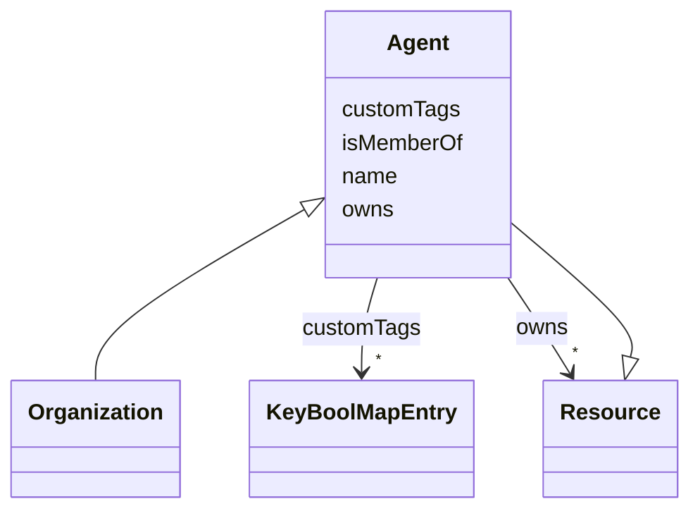

# Class: Agent 


_The human, group, or machine that consumes or acts upon an object or data. This higher-level grouping allows properties that are shared among its subclasses (Person, Organization, ….) to be anchored in one joint place, on the Agent class._


URI: [rec:Agent](https://w3id.org/rec/Agent)





## Inheritance
* [Resource](Resource.md)
    * **Agent**
        * [Organization](Organization.md)


## Slots

| Name | Cardinality and Range | Description | Inheritance |
| ---  | --- | --- | --- |
| [name](name.md) | 1 <br/> [String](String.md) | Machine or Human-readable name | direct |
| [customTags](customTags.md) | * <br/> [KeyBoolMapEntry](KeyBoolMapEntry.md) | map(string -> boolean) | direct |
| [isMemberOf](isMemberOf.md) | * <br/> [String](String.md)&nbsp;or&nbsp;<br />[Resource](Resource.md)&nbsp;or&nbsp;<br />[Organization](Organization.md) | Organization that this agent is a member of | direct |
| [owns](owns.md) | * <br/> [Resource](Resource.md) | Resources owned by this agent | direct |


## Usages

| used by | used in | type | used |
| ---  | --- | --- | --- |
| [Architecture](Architecture.md) | [architectedBy](architectedBy.md) | any_of[range] | [Agent](Agent.md) |
| [Architecture](Architecture.md) | [constructedBy](constructedBy.md) | any_of[range] | [Agent](Agent.md) |
| [Architecture](Architecture.md) | [operatedBy](operatedBy.md) | any_of[range] | [Agent](Agent.md) |
| [Architecture](Architecture.md) | [ownedBy](ownedBy.md) | any_of[range] | [Agent](Agent.md) |
| [Site](Site.md) | [architectedBy](architectedBy.md) | any_of[range] | [Agent](Agent.md) |
| [Site](Site.md) | [constructedBy](constructedBy.md) | any_of[range] | [Agent](Agent.md) |
| [Site](Site.md) | [operatedBy](operatedBy.md) | any_of[range] | [Agent](Agent.md) |
| [Site](Site.md) | [ownedBy](ownedBy.md) | any_of[range] | [Agent](Agent.md) |
| [Building](Building.md) | [architectedBy](architectedBy.md) | any_of[range] | [Agent](Agent.md) |
| [Building](Building.md) | [constructedBy](constructedBy.md) | any_of[range] | [Agent](Agent.md) |
| [Building](Building.md) | [operatedBy](operatedBy.md) | any_of[range] | [Agent](Agent.md) |
| [Building](Building.md) | [ownedBy](ownedBy.md) | any_of[range] | [Agent](Agent.md) |
| [Level](Level.md) | [architectedBy](architectedBy.md) | any_of[range] | [Agent](Agent.md) |
| [Level](Level.md) | [constructedBy](constructedBy.md) | any_of[range] | [Agent](Agent.md) |
| [Level](Level.md) | [operatedBy](operatedBy.md) | any_of[range] | [Agent](Agent.md) |
| [Level](Level.md) | [ownedBy](ownedBy.md) | any_of[range] | [Agent](Agent.md) |
| [Asset](Asset.md) | [commissionedBy](commissionedBy.md) | any_of[range] | [Agent](Agent.md) |
| [Asset](Asset.md) | [installedBy](installedBy.md) | any_of[range] | [Agent](Agent.md) |
| [Asset](Asset.md) | [manufacturedBy](manufacturedBy.md) | any_of[range] | [Agent](Agent.md) |
| [Asset](Asset.md) | [servicedBy](servicedBy.md) | any_of[range] | [Agent](Agent.md) |
| [Equipment](Equipment.md) | [commissionedBy](commissionedBy.md) | any_of[range] | [Agent](Agent.md) |
| [Equipment](Equipment.md) | [installedBy](installedBy.md) | any_of[range] | [Agent](Agent.md) |
| [Equipment](Equipment.md) | [manufacturedBy](manufacturedBy.md) | any_of[range] | [Agent](Agent.md) |
| [Equipment](Equipment.md) | [servicedBy](servicedBy.md) | any_of[range] | [Agent](Agent.md) |


## Identifier and Mapping Information


### Annotations

| property | value |
| --- | --- |
| description_ja | オブジェクトやデータを消費または作用する人間、グループ、または機械。この上位レベルのグループ化により、そのサブクラス（Person、Organization等）間で共有されるプロパティを、Agentクラスの一箇所に集約できる。 |


### Schema Source


* from schema: https://www.sbco.or.jp/ont/schema


## Mappings

| Mapping Type | Mapped Value |
| ---  | ---  |
| self | rec:Agent |
| native | sbco:Agent |


## LinkML Source

<!-- TODO: investigate https://stackoverflow.com/questions/37606292/how-to-create-tabbed-code-blocks-in-mkdocs-or-sphinx -->

### Direct

<details>
```yaml
name: Agent
annotations:
  description_ja:
    tag: description_ja
    value: オブジェクトやデータを消費または作用する人間、グループ、または機械。この上位レベルのグループ化により、そのサブクラス（Person、Organization等）間で共有されるプロパティを、Agentクラスの一箇所に集約できる。
description: The human, group, or machine that consumes or acts upon an object or
  data. This higher-level grouping allows properties that are shared among its subclasses
  (Person, Organization, ….) to be anchored in one joint place, on the Agent class.
from_schema: https://www.sbco.or.jp/ont/schema
is_a: Resource
slots:
- name
- customTags
- isMemberOf
- owns
class_uri: rec:Agent

```
</details>

### Induced

<details>
```yaml
name: Agent
annotations:
  description_ja:
    tag: description_ja
    value: オブジェクトやデータを消費または作用する人間、グループ、または機械。この上位レベルのグループ化により、そのサブクラス（Person、Organization等）間で共有されるプロパティを、Agentクラスの一箇所に集約できる。
description: The human, group, or machine that consumes or acts upon an object or
  data. This higher-level grouping allows properties that are shared among its subclasses
  (Person, Organization, ….) to be anchored in one joint place, on the Agent class.
from_schema: https://www.sbco.or.jp/ont/schema
is_a: Resource
attributes:
  name:
    name: name
    description: Machine or Human-readable name
    from_schema: https://www.sbco.or.jp/ont/schema
    rank: 1000
    alias: name
    owner: Agent
    domain_of:
    - Space
    - Asset
    - Point
    - BuildingElement
    - Agent
    - Organization
    - PostalAddress
    range: string
    required: true
  customTags:
    name: customTags
    description: map(string -> boolean)
    from_schema: https://www.sbco.or.jp/ont/schema
    rank: 1000
    alias: customTags
    owner: Agent
    domain_of:
    - Space
    - Asset
    - Point
    - BuildingElement
    - Agent
    - Organization
    - PostalAddress
    range: KeyBoolMapEntry
    multivalued: true
    inlined: true
    inlined_as_list: true
  isMemberOf:
    name: isMemberOf
    description: Organization that this agent is a member of
    from_schema: https://www.sbco.or.jp/ont/schema
    rank: 1000
    slot_uri: rec:isMemberOf
    alias: isMemberOf
    owner: Agent
    domain_of:
    - Agent
    - Organization
    range: string
    multivalued: true
    any_of:
    - range: Resource
    - range: Organization
  owns:
    name: owns
    description: Resources owned by this agent
    from_schema: https://www.sbco.or.jp/ont/schema
    rank: 1000
    slot_uri: rec:owns
    alias: owns
    owner: Agent
    domain_of:
    - Agent
    - Organization
    range: Resource
    multivalued: true
class_uri: rec:Agent

```
</details>