# Class: Architecture 


_A designed/landscaped (or potentially designed/landscaped) part of the physical world that has a 3D spatial extent. E.g., a building site, a building, levels within the building, rooms, etc._


* __NOTE__: this is an abstract class and should not be instantiated directly


URI: [rec:Architecture](https://w3id.org/rec/Architecture)

```mermaid
 classDiagram
    class Architecture
    click Architecture href "../Architecture/"
      Space <|-- Architecture
        click Space href "../Space/"
      

      Architecture <|-- Site
        click Site href "../Site/"
      Architecture <|-- Building
        click Building href "../Building/"
      Architecture <|-- Level
        click Level href "../Level/"
      

      Architecture : address
        
          
    
        
        
        Architecture --> "*" PostalAddress : address
        click PostalAddress href "../PostalAddress/"
    

        
      Architecture : adjacentElement
        
          
    
        
        
        Architecture --> "*" BuildingElement : adjacentElement
        click BuildingElement href "../BuildingElement/"
    

        
      Architecture : architectedBy
        
          
    
        
        
        Architecture --> "*" Agent : architectedBy
        click Agent href "../Agent/"
    

        
      Architecture : area
        
          
    
        
        
        Architecture --> "0..1" ArchitectureArea : area
        click ArchitectureArea href "../ArchitectureArea/"
    

        
      Architecture : capacity
        
          
    
        
        
        Architecture --> "0..1" ArchitectureCapacity : capacity
        click ArchitectureCapacity href "../ArchitectureCapacity/"
    

        
      Architecture : constructedBy
        
          
    
        
        
        Architecture --> "*" Agent : constructedBy
        click Agent href "../Agent/"
    

        
      Architecture : containsElement
        
          
    
        
        
        Architecture --> "*" BuildingElement : containsElement
        click BuildingElement href "../BuildingElement/"
    

        
      Architecture : customProperties
        
          
    
        
        
        Architecture --> "*" KeyMapOfStringMapEntry : customProperties
        click KeyMapOfStringMapEntry href "../KeyMapOfStringMapEntry/"
    

        
      Architecture : customTags
        
          
    
        
        
        Architecture --> "*" KeyBoolMapEntry : customTags
        click KeyBoolMapEntry href "../KeyBoolMapEntry/"
    

        
      Architecture : description
        
      Architecture : documentation
        
          
    
        
        
        Architecture --> "*" Document : documentation
        click Document href "../Document/"
    

        
      Architecture : geometry
        
          
    
        
        
        Architecture --> "0..1" Geometry : geometry
        click Geometry href "../Geometry/"
    

        
      Architecture : georeference
        
          
    
        
        
        Architecture --> "0..1" Georeference : georeference
        click Georeference href "../Georeference/"
    

        
      Architecture : hasPart
        
          
    
        
        
        Architecture --> "*" Space : hasPart
        click Space href "../Space/"
    

        
      Architecture : hasPoint
        
          
    
        
        
        Architecture --> "*" Point : hasPoint
        click Point href "../Point/"
    

        
      Architecture : id
        
      Architecture : identifiers
        
          
    
        
        
        Architecture --> "1..*" KeyStringMapEntry : identifiers
        click KeyStringMapEntry href "../KeyStringMapEntry/"
    

        
      Architecture : intersectingElement
        
          
    
        
        
        Architecture --> "*" BuildingElement : intersectingElement
        click BuildingElement href "../BuildingElement/"
    

        
      Architecture : isFedBy
        
          
    
        
        
        Architecture --> "*" Resource : isFedBy
        click Resource href "../Resource/"
    

        
      Architecture : isLocationOf
        
          
    
        
        
        Architecture --> "*" Resource : isLocationOf
        click Resource href "../Resource/"
    

        
      Architecture : isPartOf
        
          
    
        
        
        Architecture --> "0..1" Space : isPartOf
        click Space href "../Space/"
    

        
      Architecture : name
        
      Architecture : operatedBy
        
          
    
        
        
        Architecture --> "*" Agent : operatedBy
        click Agent href "../Agent/"
    

        
      Architecture : ownedBy
        
          
    
        
        
        Architecture --> "*" Agent : ownedBy
        click Agent href "../Agent/"
    

        
      
```





## Inheritance
* [Space](Space.md)
    * **Architecture**
        * [Site](Site.md)
        * [Building](Building.md)
        * [Level](Level.md)


## Slots

| Name | Cardinality and Range | Description | Inheritance |
| ---  | --- | --- | --- |
| [area](area.md) | 0..1 <br/> [ArchitectureArea](ArchitectureArea.md) | Area of the architecture | direct |
| [capacity](capacity.md) | 0..1 <br/> [ArchitectureCapacity](ArchitectureCapacity.md) | Capacity of the architecture | direct |
| [address](address.md) | * <br/> [PostalAddress](PostalAddress.md) | Address of the architecture | direct |
| [adjacentElement](adjacentElement.md) | * <br/> [BuildingElement](BuildingElement.md) | Building element adjacent to this architecture | direct |
| [architectedBy](architectedBy.md) | * <br/> [Agent](Agent.md) | Agent or resource that architected this structure | direct |
| [constructedBy](constructedBy.md) | * <br/> [Agent](Agent.md) | Agent or resource that constructed this architecture | direct |
| [containsElement](containsElement.md) | * <br/> [BuildingElement](BuildingElement.md) | Building element contained within this architecture | direct |
| [documentation](documentation.md) | * <br/> [Document](Document.md) | Documentation related to this asset | direct |
| [hasPoint](hasPoint.md) | * <br/> [Point](Point.md)&nbsp;or&nbsp;<br />[Point](Point.md)&nbsp;or&nbsp;<br />[PointExt](PointExt.md) | Point associated with this architecture | direct |
| [intersectingElement](intersectingElement.md) | * <br/> [BuildingElement](BuildingElement.md) | Building element intersecting with this architecture | direct |
| [isFedBy](isFedBy.md) | * <br/> [Resource](Resource.md) | Resource that feeds this architecture | direct |
| [operatedBy](operatedBy.md) | * <br/> [Agent](Agent.md) | Agent or resource that operates this architecture | direct |
| [ownedBy](ownedBy.md) | * <br/> [Agent](Agent.md) | Agent or resource that owns this architecture | direct |
| [id](id.md) | 1 <br/> [String](String.md) | Unique identifier within the schema | [Space](Space.md) |
| [geometry](geometry.md) | 0..1 <br/> [Geometry](Geometry.md) | Polygon representing the spatial extent of this Space | [Space](Space.md) |
| [georeference](georeference.md) | 0..1 <br/> [Georeference](Georeference.md) | A georeference creates a relationship between the local coordinate system use... | [Space](Space.md) |
| [hasPart](hasPart.md) | * <br/> [Space](Space.md) | The subject is composed in part of the entity given by the object | [Space](Space.md) |
| [isLocationOf](isLocationOf.md) | * <br/> [Resource](Resource.md) | Subject is the physical location encapsulating the object | [Space](Space.md) |
| [isPartOf](isPartOf.md) | 0..1 <br/> [Space](Space.md) |  | [Space](Space.md) |
| [customProperties](customProperties.md) | * <br/> [KeyMapOfStringMapEntry](KeyMapOfStringMapEntry.md) | map(string -> map(string -> string)) | [Space](Space.md) |
| [customTags](customTags.md) | * <br/> [KeyBoolMapEntry](KeyBoolMapEntry.md) | map(string -> boolean) | [Space](Space.md) |
| [identifiers](identifiers.md) | 1..* <br/> [KeyStringMapEntry](KeyStringMapEntry.md) | map(string -> string) | [Space](Space.md) |
| [name](name.md) | 1 <br/> [String](String.md) | Machine or Human-readable name | [Space](Space.md) |
| [description](description.md) | 0..1 <br/> [String](String.md) | A textual description of the resource | [Space](Space.md) |


## Identifier and Mapping Information


### Schema Source


* from schema: https://www.sbco.or.jp/ont/schema


## Mappings

| Mapping Type | Mapped Value |
| ---  | ---  |
| self | rec:Architecture |
| native | sbco:Architecture |
| exact | rec:Architecture |


## LinkML Source

<!-- TODO: investigate https://stackoverflow.com/questions/37606292/how-to-create-tabbed-code-blocks-in-mkdocs-or-sphinx -->

### Direct

<details>
```yaml
name: Architecture
description: A designed/landscaped (or potentially designed/landscaped) part of the
  physical world that has a 3D spatial extent. E.g., a building site, a building,
  levels within the building, rooms, etc.
from_schema: https://www.sbco.or.jp/ont/schema
exact_mappings:
- rec:Architecture
is_a: Space
abstract: true
slots:
- area
- capacity
- address
- adjacentElement
- architectedBy
- constructedBy
- containsElement
- documentation
- hasPoint
- intersectingElement
- isFedBy
- operatedBy
- ownedBy
slot_usage:
  hasPoint:
    name: hasPoint
    any_of:
    - range: Point
    - range: PointExt
class_uri: rec:Architecture

```
</details>

### Induced

<details>
```yaml
name: Architecture
description: A designed/landscaped (or potentially designed/landscaped) part of the
  physical world that has a 3D spatial extent. E.g., a building site, a building,
  levels within the building, rooms, etc.
from_schema: https://www.sbco.or.jp/ont/schema
exact_mappings:
- rec:Architecture
is_a: Space
abstract: true
slot_usage:
  hasPoint:
    name: hasPoint
    any_of:
    - range: Point
    - range: PointExt
attributes:
  area:
    name: area
    description: Area of the architecture
    from_schema: https://www.sbco.or.jp/ont/schema
    rank: 1000
    slot_uri: rec:area
    alias: area
    owner: Architecture
    domain_of:
    - Architecture
    range: ArchitectureArea
  capacity:
    name: capacity
    description: Capacity of the architecture
    from_schema: https://www.sbco.or.jp/ont/schema
    rank: 1000
    slot_uri: rec:capacity
    alias: capacity
    owner: Architecture
    domain_of:
    - Architecture
    range: ArchitectureCapacity
  address:
    name: address
    description: Address of the architecture
    from_schema: https://www.sbco.or.jp/ont/schema
    rank: 1000
    slot_uri: rec:address
    alias: address
    owner: Architecture
    domain_of:
    - Architecture
    range: PostalAddress
    multivalued: true
  adjacentElement:
    name: adjacentElement
    description: Building element adjacent to this architecture
    from_schema: https://www.sbco.or.jp/ont/schema
    rank: 1000
    slot_uri: rec:adjacentElement
    alias: adjacentElement
    owner: Architecture
    domain_of:
    - Architecture
    range: BuildingElement
    multivalued: true
  architectedBy:
    name: architectedBy
    description: Agent or resource that architected this structure
    from_schema: https://www.sbco.or.jp/ont/schema
    rank: 1000
    slot_uri: rec:architectedBy
    alias: architectedBy
    owner: Architecture
    domain_of:
    - Architecture
    range: Agent
    multivalued: true
  constructedBy:
    name: constructedBy
    description: Agent or resource that constructed this architecture
    from_schema: https://www.sbco.or.jp/ont/schema
    rank: 1000
    slot_uri: rec:constructedBy
    alias: constructedBy
    owner: Architecture
    domain_of:
    - Architecture
    range: Agent
    multivalued: true
  containsElement:
    name: containsElement
    description: Building element contained within this architecture
    from_schema: https://www.sbco.or.jp/ont/schema
    rank: 1000
    slot_uri: rec:containsElement
    alias: containsElement
    owner: Architecture
    domain_of:
    - Architecture
    range: BuildingElement
    multivalued: true
  documentation:
    name: documentation
    description: Documentation related to this asset
    from_schema: https://www.sbco.or.jp/ont/schema
    rank: 1000
    slot_uri: rec:documentation
    alias: documentation
    owner: Architecture
    domain_of:
    - Architecture
    - Asset
    range: Document
    multivalued: true
  hasPoint:
    name: hasPoint
    description: Point associated with this architecture
    from_schema: https://www.sbco.or.jp/ont/schema
    rank: 1000
    slot_uri: rec:hasPoint
    alias: hasPoint
    owner: Architecture
    domain_of:
    - Architecture
    - Asset
    range: Point
    multivalued: true
    any_of:
    - range: Point
    - range: PointExt
  intersectingElement:
    name: intersectingElement
    description: Building element intersecting with this architecture
    from_schema: https://www.sbco.or.jp/ont/schema
    rank: 1000
    slot_uri: rec:intersectingElement
    alias: intersectingElement
    owner: Architecture
    domain_of:
    - Architecture
    range: BuildingElement
    multivalued: true
  isFedBy:
    name: isFedBy
    annotations:
      substance:
        tag: substance
        value: SubstanceEnum
    description: Resource that feeds this architecture
    from_schema: https://www.sbco.or.jp/ont/schema
    rank: 1000
    slot_uri: rec:isFedBy
    alias: isFedBy
    owner: Architecture
    domain_of:
    - Architecture
    - Equipment
    range: Resource
    multivalued: true
  operatedBy:
    name: operatedBy
    description: Agent or resource that operates this architecture
    from_schema: https://www.sbco.or.jp/ont/schema
    rank: 1000
    slot_uri: rec:operatedBy
    alias: operatedBy
    owner: Architecture
    domain_of:
    - Architecture
    range: Agent
    multivalued: true
  ownedBy:
    name: ownedBy
    description: Agent or resource that owns this architecture
    from_schema: https://www.sbco.or.jp/ont/schema
    rank: 1000
    slot_uri: rec:ownedBy
    alias: ownedBy
    owner: Architecture
    domain_of:
    - Architecture
    range: Agent
    multivalued: true
  id:
    name: id
    annotations:
      description_ja:
        tag: description_ja
        value: スキーマ内の一意識別子。文字で開始し、DTMI形式もサポート。
      example:
        tag: example
        value: dtmi:example:Building:1
    description: Unique identifier within the schema. Must start with a letter and
      contain only letters, digits, underscores, hyphens, colons, semicolons, or periods.
      DTMI is one acceptable example.
    from_schema: https://www.sbco.or.jp/ont/schema
    rank: 1000
    identifier: true
    alias: id
    owner: Architecture
    domain_of:
    - Space
    - Asset
    - Point
    - Agent
    - Organization
    - BuildingElement
    - ArchitectureArea
    - ArchitectureCapacity
    range: string
    required: true
  geometry:
    name: geometry
    description: Polygon representing the spatial extent of this Space.
    from_schema: https://www.sbco.or.jp/ont/schema
    rank: 1000
    slot_uri: rec:geometry
    alias: geometry
    owner: Architecture
    domain_of:
    - Space
    - Asset
    range: Geometry
    multivalued: false
  georeference:
    name: georeference
    description: A georeference creates a relationship between the local coordinate
      system used within a building (e.g., measured in meters) and a geographic coordinate
      system (e.g., lat, long, alt), such that locally placed Spaces can be resolved
      and rendered in that geographic coordinate system (e.g., for mapping purposes).
    from_schema: https://www.sbco.or.jp/ont/schema
    rank: 1000
    slot_uri: rec:georeference
    alias: georeference
    owner: Architecture
    domain_of:
    - Space
    range: Georeference
    multivalued: false
  hasPart:
    name: hasPart
    description: The subject is composed in part of the entity given by the object.
    from_schema: https://www.sbco.or.jp/ont/schema
    rank: 1000
    slot_uri: rec:hasPart
    alias: hasPart
    owner: Architecture
    domain_of:
    - Space
    - Asset
    range: Space
    multivalued: true
  isLocationOf:
    name: isLocationOf
    description: Subject is the physical location encapsulating the object.
    from_schema: https://www.sbco.or.jp/ont/schema
    rank: 1000
    slot_uri: rec:isLocationOf
    alias: isLocationOf
    owner: Architecture
    domain_of:
    - Space
    range: Resource
    multivalued: true
  isPartOf:
    name: isPartOf
    from_schema: https://www.sbco.or.jp/ont/schema
    rank: 1000
    slot_uri: rec:isPartOf
    alias: isPartOf
    owner: Architecture
    domain_of:
    - Space
    - Asset
    range: Space
    multivalued: false
  customProperties:
    name: customProperties
    description: map(string -> map(string -> string))
    from_schema: https://www.sbco.or.jp/ont/schema
    rank: 1000
    slot_uri: rec:customProperties
    alias: customProperties
    owner: Architecture
    domain_of:
    - Space
    - Asset
    - Point
    - Information
    - PostalAddress
    - Agent
    - Organization
    - BuildingElement
    - ArchitectureArea
    - ArchitectureCapacity
    range: KeyMapOfStringMapEntry
    multivalued: true
    inlined: true
    inlined_as_list: true
  customTags:
    name: customTags
    description: map(string -> boolean)
    from_schema: https://www.sbco.or.jp/ont/schema
    rank: 1000
    slot_uri: rec:customTags
    alias: customTags
    owner: Architecture
    domain_of:
    - Space
    - Asset
    - Point
    - Information
    - PostalAddress
    - Agent
    - Organization
    - BuildingElement
    - ArchitectureArea
    - ArchitectureCapacity
    range: KeyBoolMapEntry
    multivalued: true
    inlined: true
    inlined_as_list: true
  identifiers:
    name: identifiers
    description: map(string -> string)
    from_schema: https://www.sbco.or.jp/ont/schema
    rank: 1000
    slot_uri: rec:identifiers
    alias: identifiers
    owner: Architecture
    domain_of:
    - Space
    - Asset
    - Point
    - Information
    - PostalAddress
    - Agent
    - Organization
    - BuildingElement
    - ArchitectureArea
    - ArchitectureCapacity
    range: KeyStringMapEntry
    required: true
    multivalued: true
    inlined: true
    inlined_as_list: true
  name:
    name: name
    description: Machine or Human-readable name
    from_schema: https://www.sbco.or.jp/ont/schema
    rank: 1000
    slot_uri: rec:name
    alias: name
    owner: Architecture
    domain_of:
    - Space
    - Asset
    - Point
    - Information
    - PostalAddress
    - Agent
    - Organization
    - BuildingElement
    - ArchitectureArea
    - ArchitectureCapacity
    range: string
    required: true
  description:
    name: description
    annotations:
      description_ja:
        tag: description_ja
        value: リソースのテキスト記述
    description: A textual description of the resource
    from_schema: https://www.sbco.or.jp/ont/schema
    rank: 1000
    slot_uri: rec:description
    alias: description
    owner: Architecture
    domain_of:
    - Space
    - Asset
    - Information
    range: string
class_uri: rec:Architecture

```
</details>