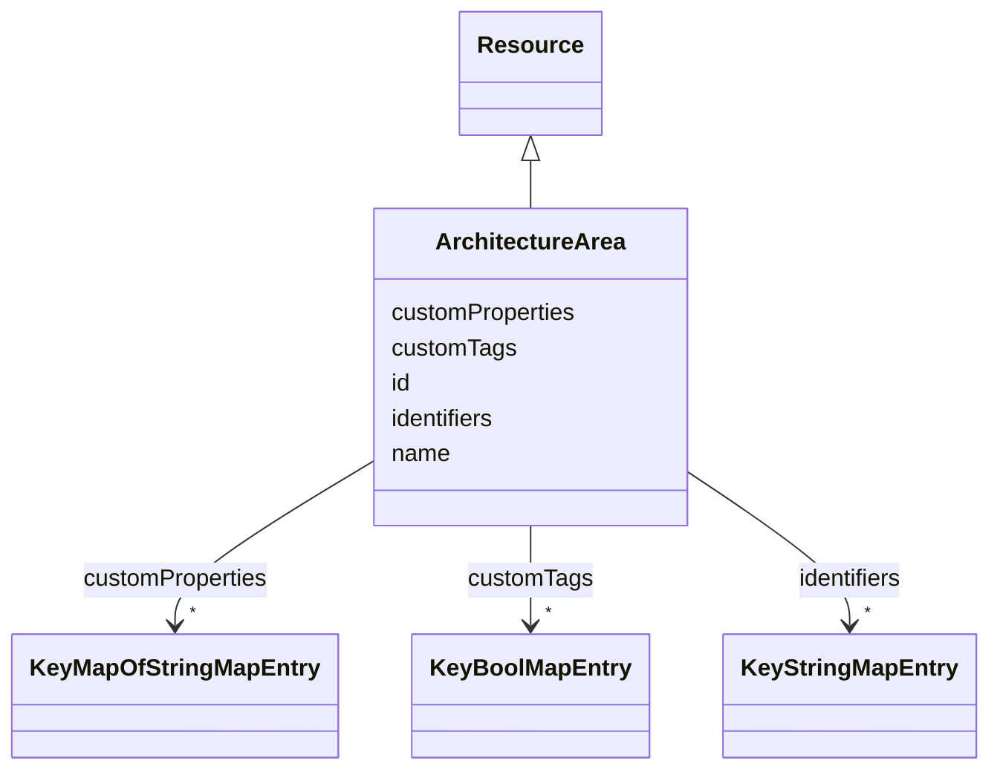

# Class: ArchitectureArea 


_Describes business-relevant area measurements typically associated with architected spaces_


URI: [rec:ArchitectureArea](https://w3id.org/rec/ArchitectureArea)





## Inheritance
* [Resource](Resource.md)
    * **ArchitectureArea**


## Slots

| Name | Cardinality and Range | Description | Inheritance |
| ---  | --- | --- | --- |
| [id](id.md) | 1 <br/> [String](String.md) | Unique identifier within the schema | direct |
| [name](name.md) | 1 <br/> [String](String.md) | Machine or Human-readable name | direct |
| [identifiers](identifiers.md) | * <br/> [KeyStringMapEntry](KeyStringMapEntry.md) | map(string -> string) | direct |
| [customTags](customTags.md) | * <br/> [KeyBoolMapEntry](KeyBoolMapEntry.md) | map(string -> boolean) | direct |
| [customProperties](customProperties.md) | * <br/> [KeyMapOfStringMapEntry](KeyMapOfStringMapEntry.md) | map(string -> map(string -> string)) | direct |


## Usages

| used by | used in | type | used |
| ---  | --- | --- | --- |
| [Architecture](Architecture.md) | [area](area.md) | range | [ArchitectureArea](ArchitectureArea.md) |
| [Site](Site.md) | [area](area.md) | range | [ArchitectureArea](ArchitectureArea.md) |
| [Building](Building.md) | [area](area.md) | range | [ArchitectureArea](ArchitectureArea.md) |
| [Level](Level.md) | [area](area.md) | range | [ArchitectureArea](ArchitectureArea.md) |
| [Room](Room.md) | [area](area.md) | range | [ArchitectureArea](ArchitectureArea.md) |
| [Zone](Zone.md) | [area](area.md) | range | [ArchitectureArea](ArchitectureArea.md) |
| [OutdoorSpace](OutdoorSpace.md) | [area](area.md) | range | [ArchitectureArea](ArchitectureArea.md) |


## Identifier and Mapping Information


### Annotations

| property | value |
| --- | --- |
| description_ja | 設計された空間に関連する業務上重要な面積測定 |


### Schema Source


* from schema: https://www.sbco.or.jp/ont/schema


## Mappings

| Mapping Type | Mapped Value |
| ---  | ---  |
| self | rec:ArchitectureArea |
| native | sbco:ArchitectureArea |
| exact | rec:ArchitectureArea |


## LinkML Source

<!-- TODO: investigate https://stackoverflow.com/questions/37606292/how-to-create-tabbed-code-blocks-in-mkdocs-or-sphinx -->

### Direct

<details>
```yaml
name: ArchitectureArea
annotations:
  description_ja:
    tag: description_ja
    value: 設計された空間に関連する業務上重要な面積測定
description: Describes business-relevant area measurements typically associated with
  architected spaces
from_schema: https://www.sbco.or.jp/ont/schema
exact_mappings:
- rec:ArchitectureArea
is_a: Resource
slots:
- id
- name
- identifiers
- customTags
- customProperties
class_uri: rec:ArchitectureArea

```
</details>

### Induced

<details>
```yaml
name: ArchitectureArea
annotations:
  description_ja:
    tag: description_ja
    value: 設計された空間に関連する業務上重要な面積測定
description: Describes business-relevant area measurements typically associated with
  architected spaces
from_schema: https://www.sbco.or.jp/ont/schema
exact_mappings:
- rec:ArchitectureArea
is_a: Resource
attributes:
  id:
    name: id
    annotations:
      description_ja:
        tag: description_ja
        value: スキーマ内の一意識別子。文字で開始し、DTMI形式もサポート。
      example:
        tag: example
        value: dtmi:example:Building:1
    description: Unique identifier within the schema. Must start with a letter and
      contain only letters, digits, underscores, hyphens, colons, semicolons, or periods.
      DTMI is one acceptable example.
    from_schema: https://www.sbco.or.jp/ont/schema
    rank: 1000
    identifier: true
    alias: id
    owner: ArchitectureArea
    domain_of:
    - Space
    - Asset
    - Point
    - Agent
    - Organization
    - BuildingElement
    - ArchitectureArea
    - ArchitectureCapacity
    range: string
    required: true
  name:
    name: name
    description: Machine or Human-readable name
    from_schema: https://www.sbco.or.jp/ont/schema
    rank: 1000
    slot_uri: rec:name
    alias: name
    owner: ArchitectureArea
    domain_of:
    - Space
    - Asset
    - Point
    - Information
    - PostalAddress
    - Agent
    - Organization
    - BuildingElement
    - ArchitectureArea
    - ArchitectureCapacity
    range: string
    required: true
  identifiers:
    name: identifiers
    description: map(string -> string)
    from_schema: https://www.sbco.or.jp/ont/schema
    rank: 1000
    slot_uri: rec:identifiers
    alias: identifiers
    owner: ArchitectureArea
    domain_of:
    - Space
    - Asset
    - Point
    - Information
    - PostalAddress
    - Agent
    - Organization
    - BuildingElement
    - ArchitectureArea
    - ArchitectureCapacity
    range: KeyStringMapEntry
    required: false
    multivalued: true
    inlined: true
    inlined_as_list: true
  customTags:
    name: customTags
    description: map(string -> boolean)
    from_schema: https://www.sbco.or.jp/ont/schema
    rank: 1000
    slot_uri: rec:customTags
    alias: customTags
    owner: ArchitectureArea
    domain_of:
    - Space
    - Asset
    - Point
    - Information
    - PostalAddress
    - Agent
    - Organization
    - BuildingElement
    - ArchitectureArea
    - ArchitectureCapacity
    range: KeyBoolMapEntry
    multivalued: true
    inlined: true
    inlined_as_list: true
  customProperties:
    name: customProperties
    description: map(string -> map(string -> string))
    from_schema: https://www.sbco.or.jp/ont/schema
    rank: 1000
    slot_uri: rec:customProperties
    alias: customProperties
    owner: ArchitectureArea
    domain_of:
    - Space
    - Asset
    - Point
    - Information
    - PostalAddress
    - Agent
    - Organization
    - BuildingElement
    - ArchitectureArea
    - ArchitectureCapacity
    range: KeyMapOfStringMapEntry
    multivalued: true
    inlined: true
    inlined_as_list: true
class_uri: rec:ArchitectureArea

```
</details>