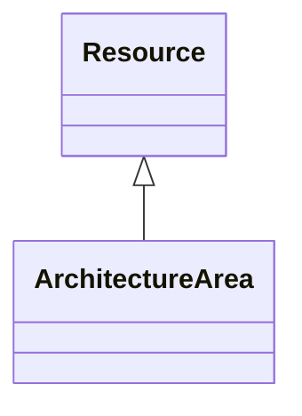

# Class: ArchitectureArea 


_Describes business-relevant area measurements typically associated with architected spaces. As the exact requirements on these measurements will vary from case to case or jurisdiction to jurisdiction, subclassing and specializing this definition is encouraged._


URI: [rec:ArchitectureArea](https://w3id.org/rec/ArchitectureArea)





## Inheritance
* [Resource](Resource.md)
    * **ArchitectureArea**


## Slots

| Name | Cardinality and Range | Description | Inheritance |
| ---  | --- | --- | --- |


## Usages

| used by | used in | type | used |
| ---  | --- | --- | --- |
| [Architecture](Architecture.md) | [area](area.md) | any_of[range] | [ArchitectureArea](ArchitectureArea.md) |
| [Site](Site.md) | [area](area.md) | any_of[range] | [ArchitectureArea](ArchitectureArea.md) |
| [Building](Building.md) | [area](area.md) | any_of[range] | [ArchitectureArea](ArchitectureArea.md) |
| [Level](Level.md) | [area](area.md) | any_of[range] | [ArchitectureArea](ArchitectureArea.md) |


## Identifier and Mapping Information


### Annotations

| property | value |
| --- | --- |
| description_ja | 建築の面積測定 |


### Schema Source


* from schema: https://www.sbco.or.jp/ont/schema


## Mappings

| Mapping Type | Mapped Value |
| ---  | ---  |
| self | rec:ArchitectureArea |
| native | sbco:ArchitectureArea |
| exact | rec:ArchitectureArea |


## LinkML Source

<!-- TODO: investigate https://stackoverflow.com/questions/37606292/how-to-create-tabbed-code-blocks-in-mkdocs-or-sphinx -->

### Direct

<details>
```yaml
name: ArchitectureArea
annotations:
  description_ja:
    tag: description_ja
    value: 建築の面積測定
description: Describes business-relevant area measurements typically associated with
  architected spaces. As the exact requirements on these measurements will vary from
  case to case or jurisdiction to jurisdiction, subclassing and specializing this
  definition is encouraged.
from_schema: https://www.sbco.or.jp/ont/schema
exact_mappings:
- rec:ArchitectureArea
is_a: Resource
class_uri: rec:ArchitectureArea

```
</details>

### Induced

<details>
```yaml
name: ArchitectureArea
annotations:
  description_ja:
    tag: description_ja
    value: 建築の面積測定
description: Describes business-relevant area measurements typically associated with
  architected spaces. As the exact requirements on these measurements will vary from
  case to case or jurisdiction to jurisdiction, subclassing and specializing this
  definition is encouraged.
from_schema: https://www.sbco.or.jp/ont/schema
exact_mappings:
- rec:ArchitectureArea
is_a: Resource
class_uri: rec:ArchitectureArea

```
</details>