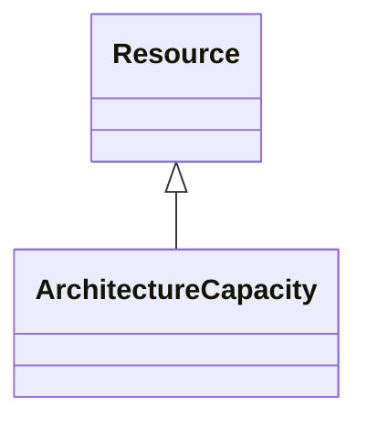

# Class: ArchitectureCapacity 


_Describes business-relevant capacity measurements typically associated with architected spaces. As the exact requirements on these measurements will vary from case to case or jurisdiction to jurisdiction, subclassing and specializing this definition is encouraged._


URI: [rec:ArchitectureCapacity](https://w3id.org/rec/ArchitectureCapacity)





## Inheritance
* [Resource](Resource.md)
    * **ArchitectureCapacity**


## Slots

| Name | Cardinality and Range | Description | Inheritance |
| ---  | --- | --- | --- |


## Usages

| used by | used in | type | used |
| ---  | --- | --- | --- |
| [Architecture](Architecture.md) | [capacity](capacity.md) | any_of[range] | [ArchitectureCapacity](ArchitectureCapacity.md) |
| [Site](Site.md) | [capacity](capacity.md) | any_of[range] | [ArchitectureCapacity](ArchitectureCapacity.md) |
| [Building](Building.md) | [capacity](capacity.md) | any_of[range] | [ArchitectureCapacity](ArchitectureCapacity.md) |
| [Level](Level.md) | [capacity](capacity.md) | any_of[range] | [ArchitectureCapacity](ArchitectureCapacity.md) |


## Identifier and Mapping Information


### Annotations

| property | value |
| --- | --- |
| description_ja | 建築の容量測定 |


### Schema Source


* from schema: https://www.sbco.or.jp/ont/schema


## Mappings

| Mapping Type | Mapped Value |
| ---  | ---  |
| self | rec:ArchitectureCapacity |
| native | sbco:ArchitectureCapacity |
| exact | rec:ArchitectureCapacity |


## LinkML Source

<!-- TODO: investigate https://stackoverflow.com/questions/37606292/how-to-create-tabbed-code-blocks-in-mkdocs-or-sphinx -->

### Direct

<details>
```yaml
name: ArchitectureCapacity
annotations:
  description_ja:
    tag: description_ja
    value: 建築の容量測定
description: Describes business-relevant capacity measurements typically associated
  with architected spaces. As the exact requirements on these measurements will vary
  from case to case or jurisdiction to jurisdiction, subclassing and specializing
  this definition is encouraged.
from_schema: https://www.sbco.or.jp/ont/schema
exact_mappings:
- rec:ArchitectureCapacity
is_a: Resource
class_uri: rec:ArchitectureCapacity

```
</details>

### Induced

<details>
```yaml
name: ArchitectureCapacity
annotations:
  description_ja:
    tag: description_ja
    value: 建築の容量測定
description: Describes business-relevant capacity measurements typically associated
  with architected spaces. As the exact requirements on these measurements will vary
  from case to case or jurisdiction to jurisdiction, subclassing and specializing
  this definition is encouraged.
from_schema: https://www.sbco.or.jp/ont/schema
exact_mappings:
- rec:ArchitectureCapacity
is_a: Resource
class_uri: rec:ArchitectureCapacity

```
</details>