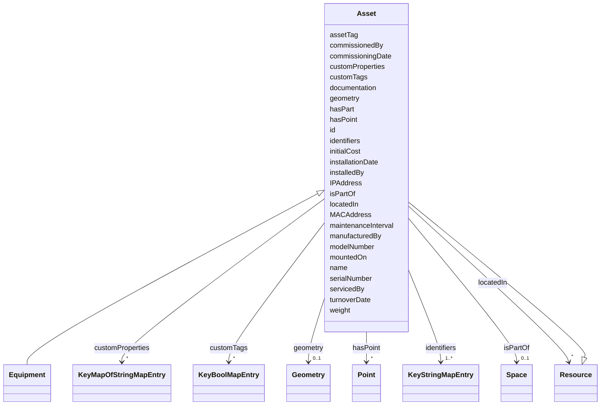

# Class: Asset 


_Something which is placed inside of a building, but is not an integral part of that building's structure; e.g., furniture, equipment, systems, etc._


URI: [rec:Asset](https://w3id.org/rec/Asset)





## Inheritance
* [Resource](Resource.md)
    * **Asset**
        * [Equipment](Equipment.md)


## Slots

| Name | Cardinality and Range | Description | Inheritance |
| ---  | --- | --- | --- |
| [id](id.md) | 1 <br/> [String](String.md) | Unique identifier within the schema | direct |
| [commissionedBy](commissionedBy.md) | * <br/> [String](String.md)&nbsp;or&nbsp;<br />[Resource](Resource.md)&nbsp;or&nbsp;<br />[Agent](Agent.md) | Agent or resource that commissioned this asset | direct |
| [documentation](documentation.md) | * <br/> [String](String.md)&nbsp;or&nbsp;<br />[Resource](Resource.md)&nbsp;or&nbsp;<br />[Document](Document.md) | Documentation related to this asset | direct |
| [geometry](geometry.md) | 0..1 <br/> [Geometry](Geometry.md) | Polygon representing the spatial extent of this Space | direct |
| [hasPart](hasPart.md) | * <br/> [String](String.md)&nbsp;or&nbsp;<br />[Space](Space.md)&nbsp;or&nbsp;<br />[Resource](Resource.md) | The subject is composed in part of the entity given by the object | direct |
| [hasPoint](hasPoint.md) | * <br/> [Point](Point.md) | Point associated with this architecture | direct |
| [installedBy](installedBy.md) | * <br/> [String](String.md)&nbsp;or&nbsp;<br />[Resource](Resource.md)&nbsp;or&nbsp;<br />[Agent](Agent.md) | Agent or resource that installed this asset | direct |
| [isPartOf](isPartOf.md) | 0..1 <br/> [Space](Space.md)&nbsp;or&nbsp;<br />[Space](Space.md)&nbsp;or&nbsp;<br />[Resource](Resource.md) |  | direct |
| [locatedIn](locatedIn.md) | * <br/> [Resource](Resource.md) | Space where this asset is located | direct |
| [manufacturedBy](manufacturedBy.md) | * <br/> [String](String.md)&nbsp;or&nbsp;<br />[Resource](Resource.md)&nbsp;or&nbsp;<br />[Agent](Agent.md) | Agent or resource that manufactured this asset | direct |
| [mountedOn](mountedOn.md) | 0..1 <br/> [String](String.md)&nbsp;or&nbsp;<br />[Resource](Resource.md)&nbsp;or&nbsp;<br />[BuildingElement](BuildingElement.md) | Building element on which this asset is mounted | direct |
| [servicedBy](servicedBy.md) | * <br/> [String](String.md)&nbsp;or&nbsp;<br />[Resource](Resource.md)&nbsp;or&nbsp;<br />[Agent](Agent.md) | Agent or resource that services this asset | direct |
| [assetTag](assetTag.md) | * <br/> [String](String.md) | Asset identification tag | direct |
| [commissioningDate](commissioningDate.md) | 0..1 <br/> [Date](Date.md) | Date when the asset was commissioned | direct |
| [customProperties](customProperties.md) | * <br/> [KeyMapOfStringMapEntry](KeyMapOfStringMapEntry.md) | map(string -> map(string -> string)) | direct |
| [customTags](customTags.md) | * <br/> [KeyBoolMapEntry](KeyBoolMapEntry.md) | map(string -> boolean) | direct |
| [identifiers](identifiers.md) | 1..* <br/> [KeyStringMapEntry](KeyStringMapEntry.md) | map(string -> string) | direct |
| [initialCost](initialCost.md) | 0..1 <br/> [String](String.md) | Initial cost of the asset | direct |
| [installationDate](installationDate.md) | 0..1 <br/> [Date](Date.md) | Date when the asset was installed | direct |
| [IPAddress](IPAddress.md) | * <br/> [String](String.md) | IP address of the asset | direct |
| [MACAddress](MACAddress.md) | * <br/> [String](String.md) | MAC address of the asset | direct |
| [maintenanceInterval](maintenanceInterval.md) | * <br/> [Duration](Duration.md) | Maintenance interval duration | direct |
| [modelNumber](modelNumber.md) | 0..1 <br/> [String](String.md) | Model number of the asset | direct |
| [name](name.md) | 1 <br/> [String](String.md) | Machine or Human-readable name | direct |
| [serialNumber](serialNumber.md) | 0..1 <br/> [String](String.md) | Serial number of the asset | direct |
| [turnoverDate](turnoverDate.md) | 0..1 <br/> [Date](Date.md) | Date when the asset was turned over | direct |
| [weight](weight.md) | 0..1 <br/> [Decimal](Decimal.md) | Weight of the asset | direct |


## Identifier and Mapping Information


### Annotations

| property | value |
| --- | --- |
| description_ja | 建物内に配置されるが、建物構造の不可欠な部分ではないもの。例：家具、設備、システムなど。 |


### Schema Source


* from schema: https://www.sbco.or.jp/ont/schema


## Mappings

| Mapping Type | Mapped Value |
| ---  | ---  |
| self | rec:Asset |
| native | sbco:Asset |


## LinkML Source

<!-- TODO: investigate https://stackoverflow.com/questions/37606292/how-to-create-tabbed-code-blocks-in-mkdocs-or-sphinx -->

### Direct

<details>
```yaml
name: Asset
annotations:
  description_ja:
    tag: description_ja
    value: 建物内に配置されるが、建物構造の不可欠な部分ではないもの。例：家具、設備、システムなど。
description: Something which is placed inside of a building, but is not an integral
  part of that building's structure; e.g., furniture, equipment, systems, etc.
from_schema: https://www.sbco.or.jp/ont/schema
is_a: Resource
slots:
- id
- commissionedBy
- documentation
- geometry
- hasPart
- hasPoint
- installedBy
- isPartOf
- locatedIn
- manufacturedBy
- mountedOn
- servicedBy
- assetTag
- commissioningDate
- customProperties
- customTags
- identifiers
- initialCost
- installationDate
- IPAddress
- MACAddress
- maintenanceInterval
- modelNumber
- name
- serialNumber
- turnoverDate
- weight
class_uri: rec:Asset

```
</details>

### Induced

<details>
```yaml
name: Asset
annotations:
  description_ja:
    tag: description_ja
    value: 建物内に配置されるが、建物構造の不可欠な部分ではないもの。例：家具、設備、システムなど。
description: Something which is placed inside of a building, but is not an integral
  part of that building's structure; e.g., furniture, equipment, systems, etc.
from_schema: https://www.sbco.or.jp/ont/schema
is_a: Resource
attributes:
  id:
    name: id
    annotations:
      description_ja:
        tag: description_ja
        value: スキーマ内の一意識別子。文字で開始し、DTMI形式もサポート。
      example:
        tag: example
        value: dtmi:example:Building:1
    description: Unique identifier within the schema. Must start with a letter and
      contain only letters, digits, underscores, hyphens, colons, semicolons, or periods
      (for DTMI format).
    from_schema: https://www.sbco.or.jp/ont/schema
    rank: 1000
    identifier: true
    alias: id
    owner: Asset
    domain_of:
    - Space
    - Asset
    range: string
    required: true
    pattern: ^(?:[a-zA-Z][a-zA-Z0-9_-:]*|dtmi:[A-Za-z0-9_:.;-]+)$
  commissionedBy:
    name: commissionedBy
    description: Agent or resource that commissioned this asset
    from_schema: https://www.sbco.or.jp/ont/schema
    rank: 1000
    slot_uri: rec:commissionedBy
    alias: commissionedBy
    owner: Asset
    domain_of:
    - Asset
    range: string
    multivalued: true
    any_of:
    - range: Resource
    - range: Agent
  documentation:
    name: documentation
    description: Documentation related to this asset
    from_schema: https://www.sbco.or.jp/ont/schema
    rank: 1000
    slot_uri: rec:documentation
    alias: documentation
    owner: Asset
    domain_of:
    - Architecture
    - Asset
    - BuildingElement
    range: string
    multivalued: true
    any_of:
    - range: Resource
    - range: Document
  geometry:
    name: geometry
    description: Polygon representing the spatial extent of this Space.
    from_schema: https://www.sbco.or.jp/ont/schema
    rank: 1000
    alias: geometry
    owner: Asset
    domain_of:
    - Space
    - Asset
    range: Geometry
    multivalued: false
  hasPart:
    name: hasPart
    description: The subject is composed in part of the entity given by the object.
    from_schema: https://www.sbco.or.jp/ont/schema
    rank: 1000
    alias: hasPart
    owner: Asset
    domain_of:
    - Space
    - Asset
    - BuildingElement
    range: string
    multivalued: true
    any_of:
    - range: Space
    - range: Resource
  hasPoint:
    name: hasPoint
    description: Point associated with this architecture
    from_schema: https://www.sbco.or.jp/ont/schema
    rank: 1000
    slot_uri: rec:hasPoint
    alias: hasPoint
    owner: Asset
    domain_of:
    - Architecture
    - Asset
    range: Point
    multivalued: true
  installedBy:
    name: installedBy
    description: Agent or resource that installed this asset
    from_schema: https://www.sbco.or.jp/ont/schema
    rank: 1000
    slot_uri: rec:installedBy
    alias: installedBy
    owner: Asset
    domain_of:
    - Asset
    range: string
    multivalued: true
    any_of:
    - range: Resource
    - range: Agent
  isPartOf:
    name: isPartOf
    from_schema: https://www.sbco.or.jp/ont/schema
    rank: 1000
    alias: isPartOf
    owner: Asset
    domain_of:
    - Space
    - Asset
    - BuildingElement
    range: Space
    multivalued: false
    any_of:
    - range: Space
    - range: Resource
  locatedIn:
    name: locatedIn
    description: Space where this asset is located
    from_schema: https://www.sbco.or.jp/ont/schema
    rank: 1000
    slot_uri: rec:locatedIn
    alias: locatedIn
    owner: Asset
    domain_of:
    - Asset
    - BuildingElement
    range: Resource
    multivalued: true
  manufacturedBy:
    name: manufacturedBy
    description: Agent or resource that manufactured this asset
    from_schema: https://www.sbco.or.jp/ont/schema
    rank: 1000
    slot_uri: rec:manufacturedBy
    alias: manufacturedBy
    owner: Asset
    domain_of:
    - Asset
    range: string
    multivalued: true
    any_of:
    - range: Resource
    - range: Agent
  mountedOn:
    name: mountedOn
    description: Building element on which this asset is mounted
    from_schema: https://www.sbco.or.jp/ont/schema
    rank: 1000
    slot_uri: rec:mountedOn
    alias: mountedOn
    owner: Asset
    domain_of:
    - Asset
    range: string
    any_of:
    - range: Resource
    - range: BuildingElement
  servicedBy:
    name: servicedBy
    description: Agent or resource that services this asset
    from_schema: https://www.sbco.or.jp/ont/schema
    rank: 1000
    slot_uri: rec:servicedBy
    alias: servicedBy
    owner: Asset
    domain_of:
    - Asset
    range: string
    multivalued: true
    any_of:
    - range: Resource
    - range: Agent
  assetTag:
    name: assetTag
    description: Asset identification tag
    from_schema: https://www.sbco.or.jp/ont/schema
    rank: 1000
    slot_uri: rec:assetTag
    alias: assetTag
    owner: Asset
    domain_of:
    - Asset
    range: string
    multivalued: true
  commissioningDate:
    name: commissioningDate
    description: Date when the asset was commissioned
    from_schema: https://www.sbco.or.jp/ont/schema
    rank: 1000
    slot_uri: rec:commissioningDate
    alias: commissioningDate
    owner: Asset
    domain_of:
    - Asset
    range: date
  customProperties:
    name: customProperties
    description: map(string -> map(string -> string))
    from_schema: https://www.sbco.or.jp/ont/schema
    rank: 1000
    alias: customProperties
    owner: Asset
    domain_of:
    - Space
    - Asset
    - Point
    - PostalAddress
    range: KeyMapOfStringMapEntry
    multivalued: true
    inlined: true
    inlined_as_list: true
  customTags:
    name: customTags
    description: map(string -> boolean)
    from_schema: https://www.sbco.or.jp/ont/schema
    rank: 1000
    alias: customTags
    owner: Asset
    domain_of:
    - Space
    - Asset
    - Point
    - BuildingElement
    - Agent
    - Organization
    - PostalAddress
    range: KeyBoolMapEntry
    multivalued: true
    inlined: true
    inlined_as_list: true
  identifiers:
    name: identifiers
    description: map(string -> string)
    from_schema: https://www.sbco.or.jp/ont/schema
    rank: 1000
    alias: identifiers
    owner: Asset
    domain_of:
    - Space
    - Asset
    - Point
    - BuildingElement
    - PostalAddress
    range: KeyStringMapEntry
    required: true
    multivalued: true
    inlined: true
    inlined_as_list: true
  initialCost:
    name: initialCost
    description: Initial cost of the asset
    from_schema: https://www.sbco.or.jp/ont/schema
    rank: 1000
    slot_uri: rec:initialCost
    alias: initialCost
    owner: Asset
    domain_of:
    - Asset
    range: string
  installationDate:
    name: installationDate
    description: Date when the asset was installed
    from_schema: https://www.sbco.or.jp/ont/schema
    rank: 1000
    slot_uri: rec:installationDate
    alias: installationDate
    owner: Asset
    domain_of:
    - Asset
    range: date
  IPAddress:
    name: IPAddress
    description: IP address of the asset
    from_schema: https://www.sbco.or.jp/ont/schema
    rank: 1000
    slot_uri: rec:IPAddress
    alias: IPAddress
    owner: Asset
    domain_of:
    - Asset
    range: string
    multivalued: true
    pattern: ^((25[0-5]|2[0-4]\d|1?\d?\d)\.){3}(25[0-5]|2[0-4]\d|1?\d?\d)$
  MACAddress:
    name: MACAddress
    description: MAC address of the asset
    from_schema: https://www.sbco.or.jp/ont/schema
    rank: 1000
    slot_uri: rec:MACAddress
    alias: MACAddress
    owner: Asset
    domain_of:
    - Asset
    range: string
    multivalued: true
    pattern: ^([0-9A-Fa-f]{2}[:-]){5}([0-9A-Fa-f]{2})$
  maintenanceInterval:
    name: maintenanceInterval
    description: Maintenance interval duration
    from_schema: https://www.sbco.or.jp/ont/schema
    rank: 1000
    slot_uri: rec:maintenanceInterval
    alias: maintenanceInterval
    owner: Asset
    domain_of:
    - Asset
    range: Duration
    multivalued: true
  modelNumber:
    name: modelNumber
    description: Model number of the asset
    from_schema: https://www.sbco.or.jp/ont/schema
    rank: 1000
    slot_uri: rec:modelNumber
    alias: modelNumber
    owner: Asset
    domain_of:
    - Asset
    range: string
  name:
    name: name
    description: Machine or Human-readable name
    from_schema: https://www.sbco.or.jp/ont/schema
    rank: 1000
    alias: name
    owner: Asset
    domain_of:
    - Space
    - Asset
    - Point
    - BuildingElement
    - Agent
    - Organization
    - PostalAddress
    range: string
    required: true
  serialNumber:
    name: serialNumber
    description: Serial number of the asset
    from_schema: https://www.sbco.or.jp/ont/schema
    rank: 1000
    slot_uri: rec:serialNumber
    alias: serialNumber
    owner: Asset
    domain_of:
    - Asset
    range: string
  turnoverDate:
    name: turnoverDate
    description: Date when the asset was turned over
    from_schema: https://www.sbco.or.jp/ont/schema
    rank: 1000
    slot_uri: rec:turnoverDate
    alias: turnoverDate
    owner: Asset
    domain_of:
    - Asset
    range: date
  weight:
    name: weight
    description: Weight of the asset
    from_schema: https://www.sbco.or.jp/ont/schema
    rank: 1000
    slot_uri: rec:weight
    alias: weight
    owner: Asset
    domain_of:
    - Asset
    range: decimal
class_uri: rec:Asset

```
</details>