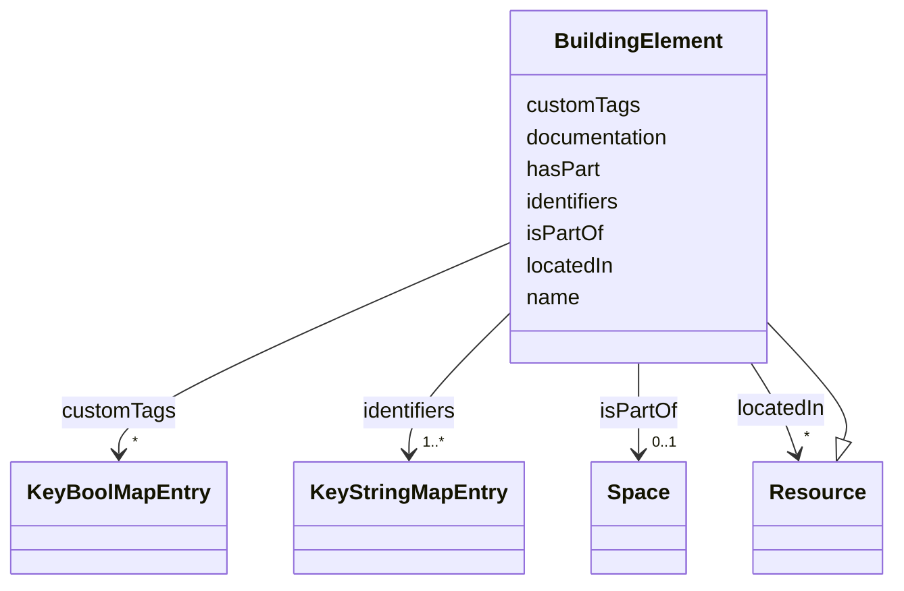

# Class: BuildingElement 


_A part that constitutes a piece of a building's structural makeup. E.g., Facade, Wall, Slab, Roof, etc._


URI: [rec:BuildingElement](https://w3id.org/rec/BuildingElement)





## Inheritance
* [Resource](Resource.md)
    * **BuildingElement**


## Slots

| Name | Cardinality and Range | Description | Inheritance |
| ---  | --- | --- | --- |
| [name](name.md) | 1 <br/> [String](String.md) | Machine or Human-readable name | direct |
| [identifiers](identifiers.md) | 1..* <br/> [KeyStringMapEntry](KeyStringMapEntry.md) | map(string -> string) | direct |
| [customTags](customTags.md) | * <br/> [KeyBoolMapEntry](KeyBoolMapEntry.md) | map(string -> boolean) | direct |
| [documentation](documentation.md) | * <br/> [String](String.md)&nbsp;or&nbsp;<br />[Resource](Resource.md)&nbsp;or&nbsp;<br />[Document](Document.md) | Documentation related to this asset | direct |
| [hasPart](hasPart.md) | * <br/> [String](String.md)&nbsp;or&nbsp;<br />[Space](Space.md)&nbsp;or&nbsp;<br />[Resource](Resource.md) | The subject is composed in part of the entity given by the object | direct |
| [isPartOf](isPartOf.md) | 0..1 <br/> [Space](Space.md)&nbsp;or&nbsp;<br />[Space](Space.md)&nbsp;or&nbsp;<br />[Resource](Resource.md) |  | direct |
| [locatedIn](locatedIn.md) | * <br/> [Resource](Resource.md) | Space where this asset is located | direct |


## Usages

| used by | used in | type | used |
| ---  | --- | --- | --- |
| [Architecture](Architecture.md) | [adjacentElement](adjacentElement.md) | any_of[range] | [BuildingElement](BuildingElement.md) |
| [Architecture](Architecture.md) | [containsElement](containsElement.md) | any_of[range] | [BuildingElement](BuildingElement.md) |
| [Architecture](Architecture.md) | [intersectingElement](intersectingElement.md) | any_of[range] | [BuildingElement](BuildingElement.md) |
| [Site](Site.md) | [adjacentElement](adjacentElement.md) | any_of[range] | [BuildingElement](BuildingElement.md) |
| [Site](Site.md) | [containsElement](containsElement.md) | any_of[range] | [BuildingElement](BuildingElement.md) |
| [Site](Site.md) | [intersectingElement](intersectingElement.md) | any_of[range] | [BuildingElement](BuildingElement.md) |
| [Building](Building.md) | [adjacentElement](adjacentElement.md) | any_of[range] | [BuildingElement](BuildingElement.md) |
| [Building](Building.md) | [containsElement](containsElement.md) | any_of[range] | [BuildingElement](BuildingElement.md) |
| [Building](Building.md) | [intersectingElement](intersectingElement.md) | any_of[range] | [BuildingElement](BuildingElement.md) |
| [Level](Level.md) | [adjacentElement](adjacentElement.md) | any_of[range] | [BuildingElement](BuildingElement.md) |
| [Level](Level.md) | [containsElement](containsElement.md) | any_of[range] | [BuildingElement](BuildingElement.md) |
| [Level](Level.md) | [intersectingElement](intersectingElement.md) | any_of[range] | [BuildingElement](BuildingElement.md) |
| [Asset](Asset.md) | [mountedOn](mountedOn.md) | any_of[range] | [BuildingElement](BuildingElement.md) |
| [Equipment](Equipment.md) | [mountedOn](mountedOn.md) | any_of[range] | [BuildingElement](BuildingElement.md) |
| [EquipmentExt](EquipmentExt.md) | [mountedOn](mountedOn.md) | any_of[range] | [BuildingElement](BuildingElement.md) |


## Identifier and Mapping Information


### Annotations

| property | value |
| --- | --- |
| description_ja | 建物の構造的構成要素。例：ファサード、壁、スラブ、屋根など。 |


### Schema Source


* from schema: https://www.sbco.or.jp/ont/schema


## Mappings

| Mapping Type | Mapped Value |
| ---  | ---  |
| self | rec:BuildingElement |
| native | sbco:BuildingElement |
| exact | rec:BuildingElement |


## LinkML Source

<!-- TODO: investigate https://stackoverflow.com/questions/37606292/how-to-create-tabbed-code-blocks-in-mkdocs-or-sphinx -->

### Direct

<details>
```yaml
name: BuildingElement
annotations:
  description_ja:
    tag: description_ja
    value: 建物の構造的構成要素。例：ファサード、壁、スラブ、屋根など。
description: A part that constitutes a piece of a building's structural makeup. E.g.,
  Facade, Wall, Slab, Roof, etc.
from_schema: https://www.sbco.or.jp/ont/schema
exact_mappings:
- rec:BuildingElement
is_a: Resource
slots:
- name
- identifiers
- customTags
- documentation
- hasPart
- isPartOf
- locatedIn
class_uri: rec:BuildingElement

```
</details>

### Induced

<details>
```yaml
name: BuildingElement
annotations:
  description_ja:
    tag: description_ja
    value: 建物の構造的構成要素。例：ファサード、壁、スラブ、屋根など。
description: A part that constitutes a piece of a building's structural makeup. E.g.,
  Facade, Wall, Slab, Roof, etc.
from_schema: https://www.sbco.or.jp/ont/schema
exact_mappings:
- rec:BuildingElement
is_a: Resource
attributes:
  name:
    name: name
    description: Machine or Human-readable name
    from_schema: https://www.sbco.or.jp/ont/schema
    rank: 1000
    slot_uri: rec:name
    alias: name
    owner: BuildingElement
    domain_of:
    - Space
    - Asset
    - Point
    - BuildingElement
    - Agent
    - PostalAddress
    range: string
    required: true
  identifiers:
    name: identifiers
    description: map(string -> string)
    from_schema: https://www.sbco.or.jp/ont/schema
    rank: 1000
    slot_uri: rec:identifiers
    alias: identifiers
    owner: BuildingElement
    domain_of:
    - Space
    - Asset
    - Point
    - BuildingElement
    - Agent
    - PostalAddress
    range: KeyStringMapEntry
    required: true
    multivalued: true
    inlined: true
    inlined_as_list: true
  customTags:
    name: customTags
    description: map(string -> boolean)
    from_schema: https://www.sbco.or.jp/ont/schema
    rank: 1000
    slot_uri: rec:customTags
    alias: customTags
    owner: BuildingElement
    domain_of:
    - Space
    - Asset
    - Point
    - BuildingElement
    - Agent
    - PostalAddress
    range: KeyBoolMapEntry
    multivalued: true
    inlined: true
    inlined_as_list: true
  documentation:
    name: documentation
    description: Documentation related to this asset
    from_schema: https://www.sbco.or.jp/ont/schema
    rank: 1000
    slot_uri: rec:documentation
    alias: documentation
    owner: BuildingElement
    domain_of:
    - Architecture
    - Asset
    - BuildingElement
    range: string
    multivalued: true
    any_of:
    - range: Resource
    - range: Document
  hasPart:
    name: hasPart
    description: The subject is composed in part of the entity given by the object.
    from_schema: https://www.sbco.or.jp/ont/schema
    rank: 1000
    slot_uri: rec:hasPart
    alias: hasPart
    owner: BuildingElement
    domain_of:
    - Space
    - Asset
    - BuildingElement
    - Organization
    range: string
    multivalued: true
    any_of:
    - range: Space
    - range: Resource
  isPartOf:
    name: isPartOf
    from_schema: https://www.sbco.or.jp/ont/schema
    rank: 1000
    slot_uri: rec:isPartOf
    alias: isPartOf
    owner: BuildingElement
    domain_of:
    - Space
    - Asset
    - BuildingElement
    - Organization
    range: Space
    multivalued: false
    any_of:
    - range: Space
    - range: Resource
  locatedIn:
    name: locatedIn
    description: Space where this asset is located
    from_schema: https://www.sbco.or.jp/ont/schema
    rank: 1000
    slot_uri: rec:locatedIn
    alias: locatedIn
    owner: BuildingElement
    domain_of:
    - Asset
    - BuildingElement
    range: Resource
    multivalued: true
class_uri: rec:BuildingElement

```
</details>