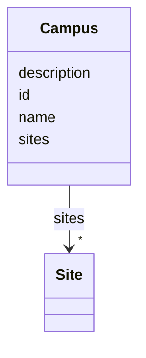

# Class: Campus 


_Top-level container for a campus with sites (optional helper class)._


URI: [ex:Campus](https://example.org/onto/Campus)





<!-- no inheritance hierarchy -->


## Slots

| Name | Cardinality and Range | Description | Inheritance |
| ---  | --- | --- | --- |
| [id](id.md) | 1 <br/> [String](String.md) | A unique identifier (URI, GUID, or local id) | direct |
| [name](name.md) | 1 <br/> [String](String.md) | Human-readable name | direct |
| [description](description.md) | 0..1 <br/> [String](String.md) |  | direct |
| [sites](sites.md) | * <br/> [Site](Site.md) | Sites that belong to this campus | direct |


## Identifier and Mapping Information


### Schema Source


* from schema: https://example.org/building-model


## Mappings

| Mapping Type | Mapped Value |
| ---  | ---  |
| self | ex:Campus |
| native | ex:Campus |


## LinkML Source

<!-- TODO: investigate https://stackoverflow.com/questions/37606292/how-to-create-tabbed-code-blocks-in-mkdocs-or-sphinx -->

### Direct

<details>
```yaml
name: Campus
description: Top-level container for a campus with sites (optional helper class).
from_schema: https://example.org/building-model
slots:
- id
- name
- description
- sites
tree_root: true

```
</details>

### Induced

<details>
```yaml
name: Campus
description: Top-level container for a campus with sites (optional helper class).
from_schema: https://example.org/building-model
attributes:
  id:
    name: id
    description: A unique identifier (URI, GUID, or local id)
    from_schema: https://example.org/building-model
    rank: 1000
    identifier: true
    alias: id
    owner: Campus
    domain_of:
    - Site
    - Building
    - Level
    - Space
    - Equipment
    - Point
    - Campus
    range: string
    required: true
  name:
    name: name
    description: Human-readable name
    from_schema: https://example.org/building-model
    rank: 1000
    alias: name
    owner: Campus
    domain_of:
    - Site
    - Building
    - Level
    - Space
    - Equipment
    - Point
    - Campus
    range: string
    required: true
  description:
    name: description
    from_schema: https://example.org/building-model
    rank: 1000
    alias: description
    owner: Campus
    domain_of:
    - Site
    - Building
    - Level
    - Space
    - Equipment
    - Point
    - Campus
    range: string
    required: false
  sites:
    name: sites
    description: Sites that belong to this campus
    from_schema: https://example.org/building-model
    rank: 1000
    alias: sites
    owner: Campus
    domain_of:
    - Campus
    range: Site
    multivalued: true
    inlined: true
    inlined_as_list: true
tree_root: true

```
</details>