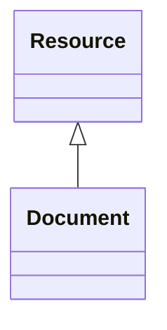

# Class: Document 


_A document providing information about a building element or asset_


URI: [rec:Document](https://w3id.org/rec/Document)





## Inheritance
* [Resource](Resource.md)
    * **Document**


## Slots

| Name | Cardinality and Range | Description | Inheritance |
| ---  | --- | --- | --- |


## Usages

| used by | used in | type | used |
| ---  | --- | --- | --- |
| [Architecture](Architecture.md) | [documentation](documentation.md) | any_of[range] | [Document](Document.md) |
| [Site](Site.md) | [documentation](documentation.md) | any_of[range] | [Document](Document.md) |
| [Building](Building.md) | [documentation](documentation.md) | any_of[range] | [Document](Document.md) |
| [Level](Level.md) | [documentation](documentation.md) | any_of[range] | [Document](Document.md) |
| [Asset](Asset.md) | [documentation](documentation.md) | any_of[range] | [Document](Document.md) |
| [Equipment](Equipment.md) | [documentation](documentation.md) | any_of[range] | [Document](Document.md) |
| [BuildingElement](BuildingElement.md) | [documentation](documentation.md) | any_of[range] | [Document](Document.md) |


## Identifier and Mapping Information


### Schema Source


* from schema: https://www.sbco.or.jp/ont/schema


## Mappings

| Mapping Type | Mapped Value |
| ---  | ---  |
| self | rec:Document |
| native | sbco:Document |


## LinkML Source

<!-- TODO: investigate https://stackoverflow.com/questions/37606292/how-to-create-tabbed-code-blocks-in-mkdocs-or-sphinx -->

### Direct

<details>
```yaml
name: Document
description: A document providing information about a building element or asset
from_schema: https://www.sbco.or.jp/ont/schema
is_a: Resource
class_uri: rec:Document

```
</details>

### Induced

<details>
```yaml
name: Document
description: A document providing information about a building element or asset
from_schema: https://www.sbco.or.jp/ont/schema
is_a: Resource
class_uri: rec:Document

```
</details>