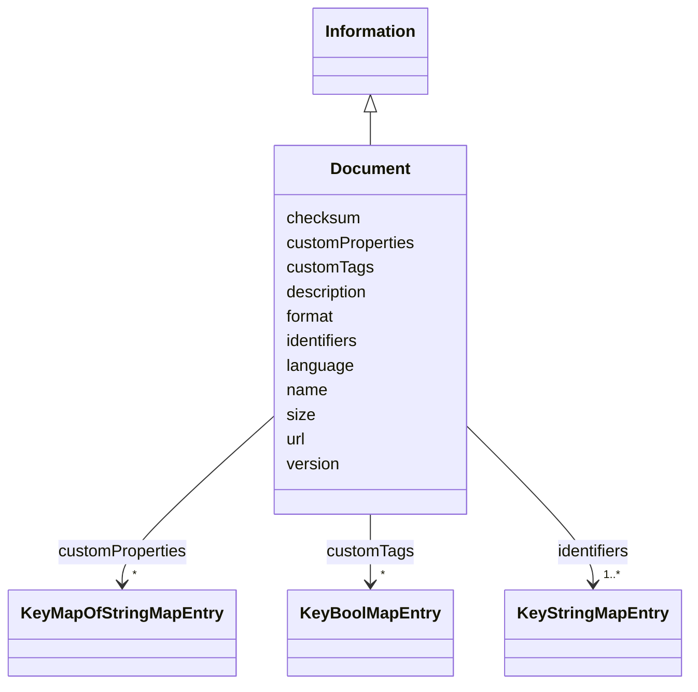

# Class: Document 


_A document providing information about a building element or asset_


URI: [rec:Document](https://w3id.org/rec/Document)





## Inheritance
* [Resource](Resource.md)
    * [Information](Information.md)
        * **Document**


## Slots

| Name | Cardinality and Range | Description | Inheritance |
| ---  | --- | --- | --- |
| [name](name.md) | 1 <br/> [String](String.md) | Machine or Human-readable name | [Information](Information.md) |
| [description](description.md) | 0..1 <br/> [String](String.md) | A textual description of the resource | [Information](Information.md) |
| [identifiers](identifiers.md) | 1..* <br/> [KeyStringMapEntry](KeyStringMapEntry.md) | map(string -> string) | [Information](Information.md) |
| [customTags](customTags.md) | * <br/> [KeyBoolMapEntry](KeyBoolMapEntry.md) | map(string -> boolean) | [Information](Information.md) |
| [customProperties](customProperties.md) | * <br/> [KeyMapOfStringMapEntry](KeyMapOfStringMapEntry.md) | map(string -> map(string -> string)) | [Information](Information.md) |
| [format](format.md) | 0..1 <br/> [String](String.md) | MIME type or format identifier for the information | [Information](Information.md) |
| [url](url.md) | 0..1 <br/> [Uri](Uri.md) | URL or URI pointing to the information resource | [Information](Information.md) |
| [version](version.md) | 0..1 <br/> [String](String.md) | Version identifier for the information | [Information](Information.md) |
| [language](language.md) | 0..1 <br/> [String](String.md) | Language code (ISO 639-1) of the information content | [Information](Information.md) |
| [size](size.md) | 0..1 <br/> [Integer](Integer.md) | Size of the information resource in bytes | [Information](Information.md) |
| [checksum](checksum.md) | 0..1 <br/> [String](String.md) | Checksum or hash of the information content | [Information](Information.md) |


## Usages

| used by | used in | type | used |
| ---  | --- | --- | --- |
| [Architecture](Architecture.md) | [documentation](documentation.md) | range | [Document](Document.md) |
| [Site](Site.md) | [documentation](documentation.md) | range | [Document](Document.md) |
| [Building](Building.md) | [documentation](documentation.md) | range | [Document](Document.md) |
| [Level](Level.md) | [documentation](documentation.md) | range | [Document](Document.md) |
| [Asset](Asset.md) | [documentation](documentation.md) | range | [Document](Document.md) |
| [Equipment](Equipment.md) | [documentation](documentation.md) | range | [Document](Document.md) |
| [EquipmentExt](EquipmentExt.md) | [documentation](documentation.md) | range | [Document](Document.md) |


## Identifier and Mapping Information


### Annotations

| property | value |
| --- | --- |
| description_ja | 建物要素やアセットに関する情報を提供するドキュメント |


### Schema Source


* from schema: https://www.sbco.or.jp/ont/schema


## Mappings

| Mapping Type | Mapped Value |
| ---  | ---  |
| self | rec:Document |
| native | sbco:Document |
| exact | rec:Document |


## LinkML Source

<!-- TODO: investigate https://stackoverflow.com/questions/37606292/how-to-create-tabbed-code-blocks-in-mkdocs-or-sphinx -->

### Direct

<details>
```yaml
name: Document
annotations:
  description_ja:
    tag: description_ja
    value: 建物要素やアセットに関する情報を提供するドキュメント
description: A document providing information about a building element or asset
from_schema: https://www.sbco.or.jp/ont/schema
exact_mappings:
- rec:Document
is_a: Information
class_uri: rec:Document

```
</details>

### Induced

<details>
```yaml
name: Document
annotations:
  description_ja:
    tag: description_ja
    value: 建物要素やアセットに関する情報を提供するドキュメント
description: A document providing information about a building element or asset
from_schema: https://www.sbco.or.jp/ont/schema
exact_mappings:
- rec:Document
is_a: Information
attributes:
  name:
    name: name
    description: Machine or Human-readable name
    from_schema: https://www.sbco.or.jp/ont/schema
    rank: 1000
    slot_uri: rec:name
    alias: name
    owner: Document
    domain_of:
    - Space
    - Asset
    - Point
    - Information
    - PostalAddress
    - Agent
    - Organization
    - BuildingElement
    - ArchitectureArea
    - ArchitectureCapacity
    range: string
    required: true
  description:
    name: description
    annotations:
      description_ja:
        tag: description_ja
        value: リソースのテキスト記述
    description: A textual description of the resource
    from_schema: https://www.sbco.or.jp/ont/schema
    rank: 1000
    slot_uri: rec:description
    alias: description
    owner: Document
    domain_of:
    - Space
    - Asset
    - Information
    range: string
  identifiers:
    name: identifiers
    description: map(string -> string)
    from_schema: https://www.sbco.or.jp/ont/schema
    rank: 1000
    slot_uri: rec:identifiers
    alias: identifiers
    owner: Document
    domain_of:
    - Space
    - Asset
    - Point
    - Information
    - PostalAddress
    - Agent
    - Organization
    - BuildingElement
    - ArchitectureArea
    - ArchitectureCapacity
    range: KeyStringMapEntry
    required: true
    multivalued: true
    inlined: true
    inlined_as_list: true
  customTags:
    name: customTags
    description: map(string -> boolean)
    from_schema: https://www.sbco.or.jp/ont/schema
    rank: 1000
    slot_uri: rec:customTags
    alias: customTags
    owner: Document
    domain_of:
    - Space
    - Asset
    - Point
    - Information
    - PostalAddress
    - Agent
    - Organization
    - BuildingElement
    - ArchitectureArea
    - ArchitectureCapacity
    range: KeyBoolMapEntry
    multivalued: true
    inlined: true
    inlined_as_list: true
  customProperties:
    name: customProperties
    description: map(string -> map(string -> string))
    from_schema: https://www.sbco.or.jp/ont/schema
    rank: 1000
    slot_uri: rec:customProperties
    alias: customProperties
    owner: Document
    domain_of:
    - Space
    - Asset
    - Point
    - Information
    - PostalAddress
    - Agent
    - Organization
    - BuildingElement
    - ArchitectureArea
    - ArchitectureCapacity
    range: KeyMapOfStringMapEntry
    multivalued: true
    inlined: true
    inlined_as_list: true
  format:
    name: format
    annotations:
      description_ja:
        tag: description_ja
        value: 情報のMIMEタイプまたはフォーマット識別子
    description: MIME type or format identifier for the information
    from_schema: https://www.sbco.or.jp/ont/schema
    rank: 1000
    slot_uri: rec:format
    alias: format
    owner: Document
    domain_of:
    - Information
    range: string
  url:
    name: url
    annotations:
      description_ja:
        tag: description_ja
        value: 情報リソースを指すURLまたはURI
    description: URL or URI pointing to the information resource
    from_schema: https://www.sbco.or.jp/ont/schema
    rank: 1000
    slot_uri: rec:url
    alias: url
    owner: Document
    domain_of:
    - Information
    range: uri
  version:
    name: version
    annotations:
      description_ja:
        tag: description_ja
        value: 情報のバージョン識別子
    description: Version identifier for the information
    from_schema: https://www.sbco.or.jp/ont/schema
    rank: 1000
    slot_uri: rec:version
    alias: version
    owner: Document
    domain_of:
    - Information
    range: string
  language:
    name: language
    annotations:
      description_ja:
        tag: description_ja
        value: 情報コンテンツの言語コード (ISO 639-1)
    description: Language code (ISO 639-1) of the information content
    from_schema: https://www.sbco.or.jp/ont/schema
    rank: 1000
    slot_uri: rec:language
    alias: language
    owner: Document
    domain_of:
    - Information
    range: string
    pattern: ^[a-z]{2}(-[A-Z]{2})?$
  size:
    name: size
    annotations:
      description_ja:
        tag: description_ja
        value: 情報リソースのサイズ（バイト）
    description: Size of the information resource in bytes
    from_schema: https://www.sbco.or.jp/ont/schema
    rank: 1000
    slot_uri: rec:size
    alias: size
    owner: Document
    domain_of:
    - Information
    range: integer
  checksum:
    name: checksum
    annotations:
      description_ja:
        tag: description_ja
        value: 情報コンテンツのチェックサムまたはハッシュ
    description: Checksum or hash of the information content
    from_schema: https://www.sbco.or.jp/ont/schema
    rank: 1000
    slot_uri: rec:checksum
    alias: checksum
    owner: Document
    domain_of:
    - Information
    range: string
class_uri: rec:Document

```
</details>