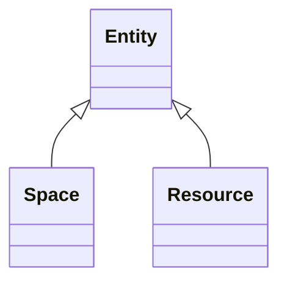

# Class: Entity 


_Base class for spaces and resources_


* __NOTE__: this is an abstract class and should not be instantiated directly


URI: [sbco:Entity](https://www.sbco.or.jp/ont/Entity)





## Inheritance
* **Entity**
    * [Space](Space.md)
    * [Resource](Resource.md)


## Slots

| Name | Cardinality and Range | Description | Inheritance |
| ---  | --- | --- | --- |


## Usages

| used by | used in | type | used |
| ---  | --- | --- | --- |
| [Space](Space.md) | [hasPart](hasPart.md) | range | [Entity](Entity.md) |
| [Space](Space.md) | [isPartOf](isPartOf.md) | range | [Entity](Entity.md) |
| [Architecture](Architecture.md) | [hasPart](hasPart.md) | range | [Entity](Entity.md) |
| [Architecture](Architecture.md) | [isPartOf](isPartOf.md) | range | [Entity](Entity.md) |
| [Site](Site.md) | [hasPart](hasPart.md) | range | [Entity](Entity.md) |
| [Site](Site.md) | [isPartOf](isPartOf.md) | range | [Entity](Entity.md) |
| [Building](Building.md) | [hasPart](hasPart.md) | range | [Entity](Entity.md) |
| [Building](Building.md) | [isPartOf](isPartOf.md) | range | [Entity](Entity.md) |
| [Level](Level.md) | [hasPart](hasPart.md) | range | [Entity](Entity.md) |
| [Level](Level.md) | [isPartOf](isPartOf.md) | range | [Entity](Entity.md) |
| [Asset](Asset.md) | [hasPart](hasPart.md) | range | [Entity](Entity.md) |
| [Asset](Asset.md) | [isPartOf](isPartOf.md) | range | [Entity](Entity.md) |
| [Equipment](Equipment.md) | [hasPart](hasPart.md) | range | [Entity](Entity.md) |
| [Equipment](Equipment.md) | [isPartOf](isPartOf.md) | range | [Entity](Entity.md) |
| [EquipmentExt](EquipmentExt.md) | [hasPart](hasPart.md) | range | [Entity](Entity.md) |
| [EquipmentExt](EquipmentExt.md) | [isPartOf](isPartOf.md) | range | [Entity](Entity.md) |


## Identifier and Mapping Information


### Schema Source


* from schema: https://www.sbco.or.jp/ont/schema


## Mappings

| Mapping Type | Mapped Value |
| ---  | ---  |
| self | sbco:Entity |
| native | sbco:Entity |


## LinkML Source

<!-- TODO: investigate https://stackoverflow.com/questions/37606292/how-to-create-tabbed-code-blocks-in-mkdocs-or-sphinx -->

### Direct

<details>
```yaml
name: Entity
description: Base class for spaces and resources
from_schema: https://www.sbco.or.jp/ont/schema
abstract: true
class_uri: sbco:Entity

```
</details>

### Induced

<details>
```yaml
name: Entity
description: Base class for spaces and resources
from_schema: https://www.sbco.or.jp/ont/schema
abstract: true
class_uri: sbco:Entity

```
</details>