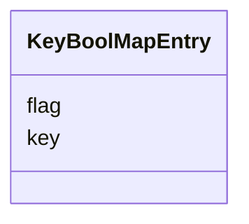

# Class: KeyBoolMapEntry 


_map(string -> boolean) の1エントリ_


URI: [sbco:KeyBoolMapEntry](https://www.sbco.or.jp/ont/KeyBoolMapEntry)





<!-- no inheritance hierarchy -->


## Slots

| Name | Cardinality and Range | Description | Inheritance |
| ---  | --- | --- | --- |
| [key](key.md) | 1 <br/> [String](String.md) |  | direct |
| [flag](flag.md) | 1 <br/> [Boolean](Boolean.md) |  | direct |


## Identifier and Mapping Information


### Schema Source


* from schema: https://www.sbco.or.jp/ont/schema


## Mappings

| Mapping Type | Mapped Value |
| ---  | ---  |
| self | sbco:KeyBoolMapEntry |
| native | sbco:KeyBoolMapEntry |


## LinkML Source

<!-- TODO: investigate https://stackoverflow.com/questions/37606292/how-to-create-tabbed-code-blocks-in-mkdocs-or-sphinx -->

### Direct

<details>
```yaml
name: KeyBoolMapEntry
description: map(string -> boolean) の1エントリ
from_schema: https://www.sbco.or.jp/ont/schema
slots:
- key
- flag
slot_usage:
  key:
    name: key
    required: true
  flag:
    name: flag
    required: true

```
</details>

### Induced

<details>
```yaml
name: KeyBoolMapEntry
description: map(string -> boolean) の1エントリ
from_schema: https://www.sbco.or.jp/ont/schema
slot_usage:
  key:
    name: key
    required: true
  flag:
    name: flag
    required: true
attributes:
  key:
    name: key
    from_schema: https://www.sbco.or.jp/ont/schema
    rank: 1000
    identifier: true
    alias: key
    owner: KeyBoolMapEntry
    domain_of:
    - KeyStringMapEntry
    - KeyBoolMapEntry
    - KeyMapOfStringMapEntry
    range: string
    required: true
  flag:
    name: flag
    from_schema: https://www.sbco.or.jp/ont/schema
    rank: 1000
    alias: flag
    owner: KeyBoolMapEntry
    domain_of:
    - KeyBoolMapEntry
    range: boolean
    required: true

```
</details>