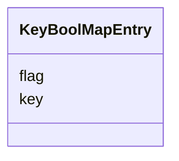

# Class: KeyBoolMapEntry 


_map(string -> boolean) の1エントリ_


URI: [sbco:KeyBoolMapEntry](https://www.sbco.or.jp/ont/KeyBoolMapEntry)





<!-- no inheritance hierarchy -->


## Slots

| Name | Cardinality and Range | Description | Inheritance |
| ---  | --- | --- | --- |
| [key](key.md) | 1 <br/> [String](String.md) | Key of the map entry | direct |
| [flag](flag.md) | 1 <br/> [Boolean](Boolean.md) | Boolean flag value | direct |


## Usages

| used by | used in | type | used |
| ---  | --- | --- | --- |
| [Space](Space.md) | [customTags](customTags.md) | range | [KeyBoolMapEntry](KeyBoolMapEntry.md) |
| [Architecture](Architecture.md) | [customTags](customTags.md) | range | [KeyBoolMapEntry](KeyBoolMapEntry.md) |
| [Site](Site.md) | [customTags](customTags.md) | range | [KeyBoolMapEntry](KeyBoolMapEntry.md) |
| [Building](Building.md) | [customTags](customTags.md) | range | [KeyBoolMapEntry](KeyBoolMapEntry.md) |
| [Level](Level.md) | [customTags](customTags.md) | range | [KeyBoolMapEntry](KeyBoolMapEntry.md) |
| [Room](Room.md) | [customTags](customTags.md) | range | [KeyBoolMapEntry](KeyBoolMapEntry.md) |
| [Zone](Zone.md) | [customTags](customTags.md) | range | [KeyBoolMapEntry](KeyBoolMapEntry.md) |
| [OutdoorSpace](OutdoorSpace.md) | [customTags](customTags.md) | range | [KeyBoolMapEntry](KeyBoolMapEntry.md) |
| [Asset](Asset.md) | [customTags](customTags.md) | range | [KeyBoolMapEntry](KeyBoolMapEntry.md) |
| [Equipment](Equipment.md) | [customTags](customTags.md) | range | [KeyBoolMapEntry](KeyBoolMapEntry.md) |
| [EquipmentExt](EquipmentExt.md) | [customTags](customTags.md) | range | [KeyBoolMapEntry](KeyBoolMapEntry.md) |
| [Point](Point.md) | [customTags](customTags.md) | range | [KeyBoolMapEntry](KeyBoolMapEntry.md) |
| [PointExt](PointExt.md) | [customTags](customTags.md) | range | [KeyBoolMapEntry](KeyBoolMapEntry.md) |
| [Information](Information.md) | [customTags](customTags.md) | range | [KeyBoolMapEntry](KeyBoolMapEntry.md) |
| [Document](Document.md) | [customTags](customTags.md) | range | [KeyBoolMapEntry](KeyBoolMapEntry.md) |
| [Image](Image.md) | [customTags](customTags.md) | range | [KeyBoolMapEntry](KeyBoolMapEntry.md) |
| [Media](Media.md) | [customTags](customTags.md) | range | [KeyBoolMapEntry](KeyBoolMapEntry.md) |
| [Schema](Schema.md) | [customTags](customTags.md) | range | [KeyBoolMapEntry](KeyBoolMapEntry.md) |
| [PostalAddress](PostalAddress.md) | [customTags](customTags.md) | range | [KeyBoolMapEntry](KeyBoolMapEntry.md) |
| [Geometry](Geometry.md) | [customTags](customTags.md) | range | [KeyBoolMapEntry](KeyBoolMapEntry.md) |
| [Georeference](Georeference.md) | [customTags](customTags.md) | range | [KeyBoolMapEntry](KeyBoolMapEntry.md) |
| [Agent](Agent.md) | [customTags](customTags.md) | range | [KeyBoolMapEntry](KeyBoolMapEntry.md) |
| [Organization](Organization.md) | [customTags](customTags.md) | range | [KeyBoolMapEntry](KeyBoolMapEntry.md) |
| [BuildingElement](BuildingElement.md) | [customTags](customTags.md) | range | [KeyBoolMapEntry](KeyBoolMapEntry.md) |
| [ArchitectureArea](ArchitectureArea.md) | [customTags](customTags.md) | range | [KeyBoolMapEntry](KeyBoolMapEntry.md) |
| [ArchitectureCapacity](ArchitectureCapacity.md) | [customTags](customTags.md) | range | [KeyBoolMapEntry](KeyBoolMapEntry.md) |


## Identifier and Mapping Information


### Schema Source


* from schema: https://www.sbco.or.jp/ont/schema


## Mappings

| Mapping Type | Mapped Value |
| ---  | ---  |
| self | sbco:KeyBoolMapEntry |
| native | sbco:KeyBoolMapEntry |


## LinkML Source

<!-- TODO: investigate https://stackoverflow.com/questions/37606292/how-to-create-tabbed-code-blocks-in-mkdocs-or-sphinx -->

### Direct

<details>
```yaml
name: KeyBoolMapEntry
description: map(string -> boolean) の1エントリ
from_schema: https://www.sbco.or.jp/ont/schema
slots:
- key
- flag
slot_usage:
  key:
    name: key
    required: true
  flag:
    name: flag
    required: true

```
</details>

### Induced

<details>
```yaml
name: KeyBoolMapEntry
description: map(string -> boolean) の1エントリ
from_schema: https://www.sbco.or.jp/ont/schema
slot_usage:
  key:
    name: key
    required: true
  flag:
    name: flag
    required: true
attributes:
  key:
    name: key
    description: Key of the map entry
    from_schema: https://www.sbco.or.jp/ont/schema
    rank: 1000
    alias: key
    owner: KeyBoolMapEntry
    domain_of:
    - KeyStringMapEntry
    - KeyBoolMapEntry
    - KeyMapOfStringMapEntry
    range: string
    required: true
  flag:
    name: flag
    description: Boolean flag value
    from_schema: https://www.sbco.or.jp/ont/schema
    rank: 1000
    alias: flag
    owner: KeyBoolMapEntry
    domain_of:
    - KeyBoolMapEntry
    range: boolean
    required: true

```
</details>