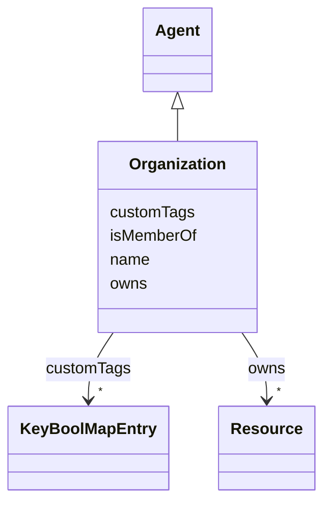

# Class: Organization 


_An organization such as a company, institution, or association_


URI: [rec:Organization](https://w3id.org/rec/Organization)





## Inheritance
* [Resource](Resource.md)
    * [Agent](Agent.md)
        * **Organization**


## Slots

| Name | Cardinality and Range | Description | Inheritance |
| ---  | --- | --- | --- |
| [name](name.md) | 1 <br/> [String](String.md) | Machine or Human-readable name | direct |
| [customTags](customTags.md) | * <br/> [KeyBoolMapEntry](KeyBoolMapEntry.md) | map(string -> boolean) | direct |
| [isMemberOf](isMemberOf.md) | * <br/> [String](String.md)&nbsp;or&nbsp;<br />[Resource](Resource.md)&nbsp;or&nbsp;<br />[Organization](Organization.md) | Organization that this agent is a member of | direct |
| [owns](owns.md) | * <br/> [Resource](Resource.md) | Resources owned by this agent | direct |


## Usages

| used by | used in | type | used |
| ---  | --- | --- | --- |
| [Agent](Agent.md) | [isMemberOf](isMemberOf.md) | any_of[range] | [Organization](Organization.md) |
| [Organization](Organization.md) | [isMemberOf](isMemberOf.md) | any_of[range] | [Organization](Organization.md) |


## Identifier and Mapping Information


### Annotations

| property | value |
| --- | --- |
| description_ja | 会社、機関、協会などの組織 |


### Schema Source


* from schema: https://www.sbco.or.jp/ont/schema


## Mappings

| Mapping Type | Mapped Value |
| ---  | ---  |
| self | rec:Organization |
| native | sbco:Organization |


## LinkML Source

<!-- TODO: investigate https://stackoverflow.com/questions/37606292/how-to-create-tabbed-code-blocks-in-mkdocs-or-sphinx -->

### Direct

<details>
```yaml
name: Organization
annotations:
  description_ja:
    tag: description_ja
    value: 会社、機関、協会などの組織
description: An organization such as a company, institution, or association
from_schema: https://www.sbco.or.jp/ont/schema
is_a: Agent
slots:
- name
- customTags
- isMemberOf
- owns
class_uri: rec:Organization

```
</details>

### Induced

<details>
```yaml
name: Organization
annotations:
  description_ja:
    tag: description_ja
    value: 会社、機関、協会などの組織
description: An organization such as a company, institution, or association
from_schema: https://www.sbco.or.jp/ont/schema
is_a: Agent
attributes:
  name:
    name: name
    description: Machine or Human-readable name
    from_schema: https://www.sbco.or.jp/ont/schema
    rank: 1000
    alias: name
    owner: Organization
    domain_of:
    - Space
    - Asset
    - Point
    - BuildingElement
    - Agent
    - Organization
    range: string
    required: true
  customTags:
    name: customTags
    description: map(string -> boolean)
    from_schema: https://www.sbco.or.jp/ont/schema
    rank: 1000
    alias: customTags
    owner: Organization
    domain_of:
    - Space
    - Asset
    - Point
    - BuildingElement
    - Agent
    - Organization
    range: KeyBoolMapEntry
    multivalued: true
    inlined: true
    inlined_as_list: true
  isMemberOf:
    name: isMemberOf
    description: Organization that this agent is a member of
    from_schema: https://www.sbco.or.jp/ont/schema
    rank: 1000
    slot_uri: rec:isMemberOf
    alias: isMemberOf
    owner: Organization
    domain_of:
    - Agent
    - Organization
    range: string
    multivalued: true
    any_of:
    - range: Resource
    - range: Organization
  owns:
    name: owns
    description: Resources owned by this agent
    from_schema: https://www.sbco.or.jp/ont/schema
    rank: 1000
    slot_uri: rec:owns
    alias: owns
    owner: Organization
    domain_of:
    - Agent
    - Organization
    range: Resource
    multivalued: true
class_uri: rec:Organization

```
</details>