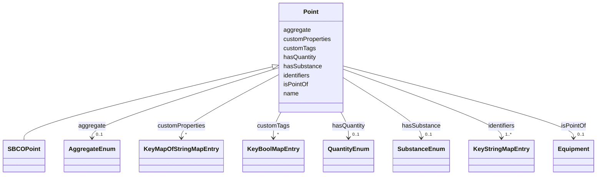

# Class: Point 


_A sensor, actuator, or data point associated with equipment._


URI: [brick:Point](https://brickschema.org/schema/Brick#Point)





## Inheritance
* **Point**
    * [SBCOPoint](SBCOPoint.md)


## Slots

| Name | Cardinality and Range | Description | Inheritance |
| ---  | --- | --- | --- |
| [isPointOf](isPointOf.md) | 0..1 <br/> [Equipment](Equipment.md) | Equipment that this point belongs to | direct |
| [aggregate](aggregate.md) | 0..1 <br/> [AggregateEnum](AggregateEnum.md) | Aggregation function or method for point data processing | direct |
| [customProperties](customProperties.md) | * <br/> [KeyMapOfStringMapEntry](KeyMapOfStringMapEntry.md) | map(string -> map(string -> string)) | direct |
| [customTags](customTags.md) | * <br/> [KeyBoolMapEntry](KeyBoolMapEntry.md) | map(string -> boolean) | direct |
| [hasQuantity](hasQuantity.md) | 0..1 <br/> [QuantityEnum](QuantityEnum.md) | Physical quantity measured by this point | direct |
| [hasSubstance](hasSubstance.md) | 0..1 <br/> [SubstanceEnum](SubstanceEnum.md) | Substance associated with this point | direct |
| [identifiers](identifiers.md) | 1..* <br/> [KeyStringMapEntry](KeyStringMapEntry.md) | map(string -> string) | direct |
| [name](name.md) | 1 <br/> [String](String.md) | Machine or Human-readable name | direct |


## Usages

| used by | used in | type | used |
| ---  | --- | --- | --- |
| [Architecture](Architecture.md) | [hasPoint](hasPoint.md) | any_of[range] | [Point](Point.md) |
| [Site](Site.md) | [hasPoint](hasPoint.md) | any_of[range] | [Point](Point.md) |
| [Building](Building.md) | [hasPoint](hasPoint.md) | any_of[range] | [Point](Point.md) |
| [Level](Level.md) | [hasPoint](hasPoint.md) | any_of[range] | [Point](Point.md) |
| [Asset](Asset.md) | [hasPoint](hasPoint.md) | any_of[range] | [Point](Point.md) |
| [Equipment](Equipment.md) | [hasPoint](hasPoint.md) | any_of[range] | [Point](Point.md) |


## Identifier and Mapping Information


### Annotations

| property | value |
| --- | --- |
| description_ja | 設備に紐づくセンサー/アクチュエータ/データポイント。 |


### Schema Source


* from schema: https://www.sbco.or.jp/ont/schema


## Mappings

| Mapping Type | Mapped Value |
| ---  | ---  |
| self | brick:Point |
| native | sbco:Point |


## LinkML Source

<!-- TODO: investigate https://stackoverflow.com/questions/37606292/how-to-create-tabbed-code-blocks-in-mkdocs-or-sphinx -->

### Direct

<details>
```yaml
name: Point
annotations:
  description_ja:
    tag: description_ja
    value: 設備に紐づくセンサー/アクチュエータ/データポイント。
description: A sensor, actuator, or data point associated with equipment.
from_schema: https://www.sbco.or.jp/ont/schema
slots:
- isPointOf
- aggregate
- customProperties
- customTags
- hasQuantity
- hasSubstance
- identifiers
- name
class_uri: brick:Point

```
</details>

### Induced

<details>
```yaml
name: Point
annotations:
  description_ja:
    tag: description_ja
    value: 設備に紐づくセンサー/アクチュエータ/データポイント。
description: A sensor, actuator, or data point associated with equipment.
from_schema: https://www.sbco.or.jp/ont/schema
attributes:
  isPointOf:
    name: isPointOf
    annotations:
      description_ja:
        tag: description_ja
        value: このポイントが属する設備
    description: Equipment that this point belongs to
    from_schema: https://www.sbco.or.jp/ont/schema
    rank: 1000
    slot_uri: brick:isPointOf
    alias: isPointOf
    owner: Point
    domain_of:
    - Point
    inverse: hasPoint
    range: Equipment
  aggregate:
    name: aggregate
    annotations:
      description_ja:
        tag: description_ja
        value: ポイントデータ処理のための集約関数または方法
      azure_dtdl_type:
        tag: azure_dtdl_type
        value: DTObjectInfo
    description: Aggregation function or method for point data processing
    from_schema: https://www.sbco.or.jp/ont/schema
    rank: 1000
    slot_uri: brick:aggregate
    alias: aggregate
    owner: Point
    domain_of:
    - Point
    range: AggregateEnum
  customProperties:
    name: customProperties
    description: map(string -> map(string -> string))
    from_schema: https://www.sbco.or.jp/ont/schema
    rank: 1000
    alias: customProperties
    owner: Point
    domain_of:
    - Space
    - Asset
    - Point
    range: KeyMapOfStringMapEntry
    multivalued: true
    inlined: true
    inlined_as_list: true
  customTags:
    name: customTags
    description: map(string -> boolean)
    from_schema: https://www.sbco.or.jp/ont/schema
    rank: 1000
    alias: customTags
    owner: Point
    domain_of:
    - Space
    - Asset
    - Point
    - BuildingElement
    - Agent
    - Organization
    range: KeyBoolMapEntry
    multivalued: true
    inlined: true
    inlined_as_list: true
  hasQuantity:
    name: hasQuantity
    annotations:
      description_ja:
        tag: description_ja
        value: このポイントで測定される物理量
    description: Physical quantity measured by this point
    from_schema: https://www.sbco.or.jp/ont/schema
    rank: 1000
    slot_uri: brick:hasQuantity
    alias: hasQuantity
    owner: Point
    domain_of:
    - Point
    range: QuantityEnum
  hasSubstance:
    name: hasSubstance
    annotations:
      description_ja:
        tag: description_ja
        value: このポイントに関連する物質
    description: Substance associated with this point
    from_schema: https://www.sbco.or.jp/ont/schema
    rank: 1000
    slot_uri: brick:hasSubstance
    alias: hasSubstance
    owner: Point
    domain_of:
    - Point
    range: SubstanceEnum
  identifiers:
    name: identifiers
    description: map(string -> string)
    from_schema: https://www.sbco.or.jp/ont/schema
    rank: 1000
    alias: identifiers
    owner: Point
    domain_of:
    - Space
    - Asset
    - Point
    - BuildingElement
    range: KeyStringMapEntry
    required: true
    multivalued: true
    inlined: true
    inlined_as_list: true
  name:
    name: name
    description: Machine or Human-readable name
    from_schema: https://www.sbco.or.jp/ont/schema
    rank: 1000
    alias: name
    owner: Point
    domain_of:
    - Space
    - Asset
    - Point
    - BuildingElement
    - Agent
    - Organization
    range: string
    required: true
class_uri: brick:Point

```
</details>