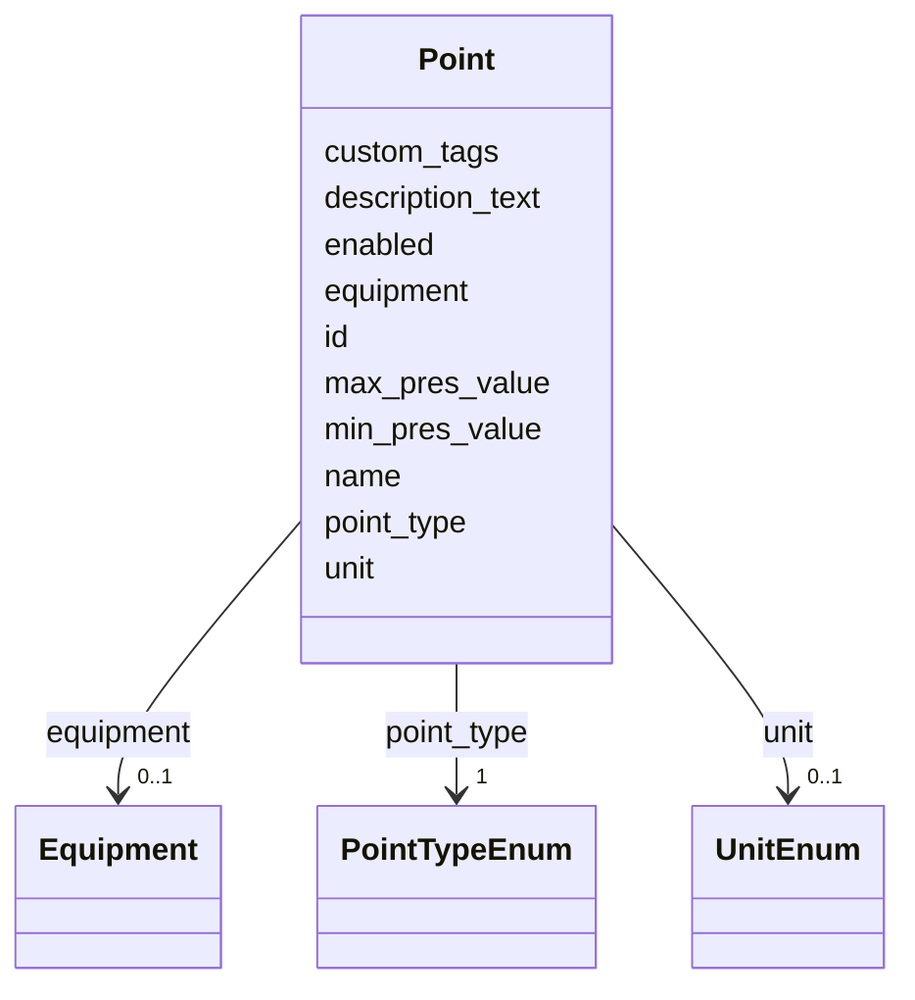

# Class: Point 


_A sensor, actuator, or data point associated with equipment._


URI: [rec:Point](https://w3id.org/rec/Point)





<!-- no inheritance hierarchy -->


## Slots

| Name | Cardinality and Range | Description | Inheritance |
| ---  | --- | --- | --- |
| [id](id.md) | 1 <br/> [String](String.md) | Stable identifier (local or global) | direct |
| [name](name.md) | 0..1 <br/> [String](String.md) | Human-readable name | direct |
| [description_text](description_text.md) | 0..1 <br/> [String](String.md) | Description (English) | direct |
| [custom_tags](custom_tags.md) | * <br/> [String](String.md) | Arbitrary tags | direct |
| [equipment](equipment.md) | 0..1 <br/> [Equipment](Equipment.md) | Parent equipment | direct |
| [enabled](enabled.md) | 0..1 <br/> [Boolean](Boolean.md) | Whether the point is enabled/active | direct |
| [point_type](point_type.md) | 1 <br/> [PointTypeEnum](PointTypeEnum.md) | Point type (e | direct |
| [unit](unit.md) | 0..1 <br/> [UnitEnum](UnitEnum.md) | Measurement unit (enum key; symbol can be taken from annotations) | direct |
| [min_pres_value](min_pres_value.md) | 0..1 <br/> [Float](Float.md) | Minimum plausible reading | direct |
| [max_pres_value](max_pres_value.md) | 0..1 <br/> [Float](Float.md) | Maximum plausible reading | direct |


## Usages

| used by | used in | type | used |
| ---  | --- | --- | --- |
| [Equipment](Equipment.md) | [points](points.md) | range | [Point](Point.md) |


## Rules


### 

| Rule Applied | Preconditions | Postconditions | Elseconditions |
|--------------|---------------|----------------|----------------|
| slot_conditions |```{'point_type': {'id_prefixes': ['Temperature']}}``` |```{'unit': {'equals_string': 'celsius'}, 'max_pres_value': {'minimum_value': -50, 'maximum_value': 100}}``` | |


### 

| Rule Applied | Preconditions | Postconditions | Elseconditions |
|--------------|---------------|----------------|----------------|
| slot_conditions |```{'point_type': {'id_prefixes': ['Humidity']}}``` |```{'unit': {'equals_string': 'percent'}, 'max_pres_value': {'minimum_value': 0, 'maximum_value': 100}}``` | |


### 

| Rule Applied | Preconditions | Postconditions | Elseconditions |
|--------------|---------------|----------------|----------------|
| slot_conditions |```{'point_type': {'id_prefixes': ['CO2']}}``` |```{'unit': {'equals_string': 'ppm'}, 'max_pres_value': {'minimum_value': 0, 'maximum_value': 10000}}``` | |


## Identifier and Mapping Information


### Annotations

| property | value |
| --- | --- |
| description_ja | 設備に紐づくセンサー/アクチュエータ/データポイント。 |


### Schema Source


* from schema: https://www.sbco.or.jp/ont/schema


## Mappings

| Mapping Type | Mapped Value |
| ---  | ---  |
| self | rec:Point |
| native | sbco:Point |


## LinkML Source

<!-- TODO: investigate https://stackoverflow.com/questions/37606292/how-to-create-tabbed-code-blocks-in-mkdocs-or-sphinx -->

### Direct

<details>
```yaml
name: Point
annotations:
  description_ja:
    tag: description_ja
    value: 設備に紐づくセンサー/アクチュエータ/データポイント。
description: A sensor, actuator, or data point associated with equipment.
from_schema: https://www.sbco.or.jp/ont/schema
slots:
- id
- name
- description_text
- custom_tags
- equipment
- enabled
- point_type
- unit
- min_pres_value
- max_pres_value
class_uri: rec:Point
rules:
- preconditions:
    slot_conditions:
      point_type:
        name: point_type
        id_prefixes:
        - Temperature
  postconditions:
    slot_conditions:
      unit:
        name: unit
        equals_string: celsius
      max_pres_value:
        name: max_pres_value
        minimum_value: -50
        maximum_value: 100
  description: Temperature points should have reasonable range and Celsius unit
- preconditions:
    slot_conditions:
      point_type:
        name: point_type
        id_prefixes:
        - Humidity
  postconditions:
    slot_conditions:
      unit:
        name: unit
        equals_string: percent
      max_pres_value:
        name: max_pres_value
        minimum_value: 0
        maximum_value: 100
  description: Humidity points must be 0–100% range
- preconditions:
    slot_conditions:
      point_type:
        name: point_type
        id_prefixes:
        - CO2
  postconditions:
    slot_conditions:
      unit:
        name: unit
        equals_string: ppm
      max_pres_value:
        name: max_pres_value
        minimum_value: 0
        maximum_value: 10000
  description: CO2 points should have a reasonable ppm range

```
</details>

### Induced

<details>
```yaml
name: Point
annotations:
  description_ja:
    tag: description_ja
    value: 設備に紐づくセンサー/アクチュエータ/データポイント。
description: A sensor, actuator, or data point associated with equipment.
from_schema: https://www.sbco.or.jp/ont/schema
attributes:
  id:
    name: id
    description: Stable identifier (local or global)
    from_schema: https://www.sbco.or.jp/ont/schema
    rank: 1000
    identifier: true
    alias: id
    owner: Point
    domain_of:
    - Site
    - Building
    - Level
    - Space
    - Equipment
    - Point
    range: string
    required: true
  name:
    name: name
    description: Human-readable name
    from_schema: https://www.sbco.or.jp/ont/schema
    rank: 1000
    alias: name
    owner: Point
    domain_of:
    - Site
    - Building
    - Level
    - Space
    - Equipment
    - Point
    range: string
  description_text:
    name: description_text
    description: Description (English). For multilingual, see annotations on each
      object.
    from_schema: https://www.sbco.or.jp/ont/schema
    rank: 1000
    alias: description_text
    owner: Point
    domain_of:
    - Site
    - Building
    - Level
    - Space
    - Equipment
    - Point
    range: string
  custom_tags:
    name: custom_tags
    description: Arbitrary tags
    from_schema: https://www.sbco.or.jp/ont/schema
    rank: 1000
    alias: custom_tags
    owner: Point
    domain_of:
    - Site
    - Building
    - Level
    - Space
    - Equipment
    - Point
    range: string
    multivalued: true
  equipment:
    name: equipment
    description: Parent equipment
    from_schema: https://www.sbco.or.jp/ont/schema
    rank: 1000
    alias: equipment
    owner: Point
    domain_of:
    - Point
    range: Equipment
  enabled:
    name: enabled
    description: Whether the point is enabled/active
    from_schema: https://www.sbco.or.jp/ont/schema
    rank: 1000
    ifabsent: 'True'
    alias: enabled
    owner: Point
    domain_of:
    - Point
    range: boolean
  point_type:
    name: point_type
    description: Point type (e.g., Temperature, Humidity, CO2)
    from_schema: https://www.sbco.or.jp/ont/schema
    rank: 1000
    alias: point_type
    owner: Point
    domain_of:
    - Point
    range: PointTypeEnum
    required: true
  unit:
    name: unit
    description: Measurement unit (enum key; symbol can be taken from annotations)
    from_schema: https://www.sbco.or.jp/ont/schema
    rank: 1000
    alias: unit
    owner: Point
    domain_of:
    - Point
    range: UnitEnum
  min_pres_value:
    name: min_pres_value
    description: Minimum plausible reading
    from_schema: https://www.sbco.or.jp/ont/schema
    rank: 1000
    alias: min_pres_value
    owner: Point
    domain_of:
    - Point
    range: float
  max_pres_value:
    name: max_pres_value
    description: Maximum plausible reading
    from_schema: https://www.sbco.or.jp/ont/schema
    rank: 1000
    alias: max_pres_value
    owner: Point
    domain_of:
    - Point
    range: float
class_uri: rec:Point
rules:
- preconditions:
    slot_conditions:
      point_type:
        name: point_type
        id_prefixes:
        - Temperature
  postconditions:
    slot_conditions:
      unit:
        name: unit
        equals_string: celsius
      max_pres_value:
        name: max_pres_value
        minimum_value: -50
        maximum_value: 100
  description: Temperature points should have reasonable range and Celsius unit
- preconditions:
    slot_conditions:
      point_type:
        name: point_type
        id_prefixes:
        - Humidity
  postconditions:
    slot_conditions:
      unit:
        name: unit
        equals_string: percent
      max_pres_value:
        name: max_pres_value
        minimum_value: 0
        maximum_value: 100
  description: Humidity points must be 0–100% range
- preconditions:
    slot_conditions:
      point_type:
        name: point_type
        id_prefixes:
        - CO2
  postconditions:
    slot_conditions:
      unit:
        name: unit
        equals_string: ppm
      max_pres_value:
        name: max_pres_value
        minimum_value: 0
        maximum_value: 10000
  description: CO2 points should have a reasonable ppm range

```
</details>