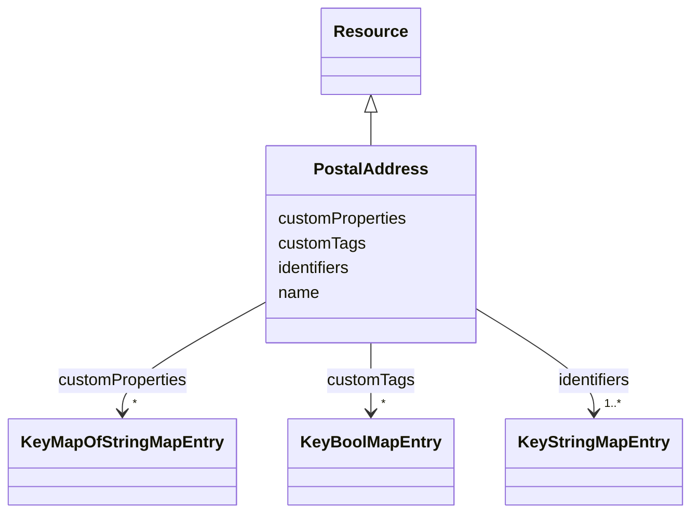

# Class: PostalAddress 


_A postal address_


URI: [rec:PostalAddress](https://w3id.org/rec/PostalAddress)





## Inheritance
* [Resource](Resource.md)
    * **PostalAddress**


## Slots

| Name | Cardinality and Range | Description | Inheritance |
| ---  | --- | --- | --- |
| [name](name.md) | 1 <br/> [String](String.md) | Machine or Human-readable name | direct |
| [identifiers](identifiers.md) | 1..* <br/> [KeyStringMapEntry](KeyStringMapEntry.md) | map(string -> string) | direct |
| [customTags](customTags.md) | * <br/> [KeyBoolMapEntry](KeyBoolMapEntry.md) | map(string -> boolean) | direct |
| [customProperties](customProperties.md) | * <br/> [KeyMapOfStringMapEntry](KeyMapOfStringMapEntry.md) | map(string -> map(string -> string)) | direct |


## Usages

| used by | used in | type | used |
| ---  | --- | --- | --- |
| [Architecture](Architecture.md) | [address](address.md) | range | [PostalAddress](PostalAddress.md) |
| [Site](Site.md) | [address](address.md) | range | [PostalAddress](PostalAddress.md) |
| [Building](Building.md) | [address](address.md) | range | [PostalAddress](PostalAddress.md) |
| [Level](Level.md) | [address](address.md) | range | [PostalAddress](PostalAddress.md) |


## Identifier and Mapping Information


### Annotations

| property | value |
| --- | --- |
| description_ja | 郵便住所 |


### Schema Source


* from schema: https://www.sbco.or.jp/ont/schema


## Mappings

| Mapping Type | Mapped Value |
| ---  | ---  |
| self | rec:PostalAddress |
| native | sbco:PostalAddress |
| exact | rec:PostalAddress |


## LinkML Source

<!-- TODO: investigate https://stackoverflow.com/questions/37606292/how-to-create-tabbed-code-blocks-in-mkdocs-or-sphinx -->

### Direct

<details>
```yaml
name: PostalAddress
annotations:
  description_ja:
    tag: description_ja
    value: 郵便住所
description: A postal address
from_schema: https://www.sbco.or.jp/ont/schema
exact_mappings:
- rec:PostalAddress
is_a: Resource
slots:
- name
- identifiers
- customTags
- customProperties
class_uri: rec:PostalAddress

```
</details>

### Induced

<details>
```yaml
name: PostalAddress
annotations:
  description_ja:
    tag: description_ja
    value: 郵便住所
description: A postal address
from_schema: https://www.sbco.or.jp/ont/schema
exact_mappings:
- rec:PostalAddress
is_a: Resource
attributes:
  name:
    name: name
    description: Machine or Human-readable name
    from_schema: https://www.sbco.or.jp/ont/schema
    rank: 1000
    slot_uri: rec:name
    alias: name
    owner: PostalAddress
    domain_of:
    - Space
    - Asset
    - Point
    - BuildingElement
    - Agent
    - PostalAddress
    range: string
    required: true
  identifiers:
    name: identifiers
    description: map(string -> string)
    from_schema: https://www.sbco.or.jp/ont/schema
    rank: 1000
    slot_uri: rec:identifiers
    alias: identifiers
    owner: PostalAddress
    domain_of:
    - Space
    - Asset
    - Point
    - BuildingElement
    - Agent
    - PostalAddress
    range: KeyStringMapEntry
    required: true
    multivalued: true
    inlined: true
    inlined_as_list: true
  customTags:
    name: customTags
    description: map(string -> boolean)
    from_schema: https://www.sbco.or.jp/ont/schema
    rank: 1000
    slot_uri: rec:customTags
    alias: customTags
    owner: PostalAddress
    domain_of:
    - Space
    - Asset
    - Point
    - BuildingElement
    - Agent
    - PostalAddress
    range: KeyBoolMapEntry
    multivalued: true
    inlined: true
    inlined_as_list: true
  customProperties:
    name: customProperties
    description: map(string -> map(string -> string))
    from_schema: https://www.sbco.or.jp/ont/schema
    rank: 1000
    slot_uri: rec:customProperties
    alias: customProperties
    owner: PostalAddress
    domain_of:
    - Space
    - Asset
    - Point
    - Agent
    - PostalAddress
    range: KeyMapOfStringMapEntry
    multivalued: true
    inlined: true
    inlined_as_list: true
class_uri: rec:PostalAddress

```
</details>