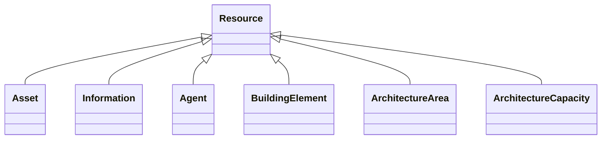

# Class: Resource 


_Base class for all resources_


* __NOTE__: this is an abstract class and should not be instantiated directly


URI: [rdfs:Resource](http://www.w3.org/2000/01/rdf-schema#Resource)





## Inheritance
* **Resource**
    * [Asset](Asset.md)
    * [Information](Information.md)
    * [Agent](Agent.md)
    * [BuildingElement](BuildingElement.md)
    * [ArchitectureArea](ArchitectureArea.md)
    * [ArchitectureCapacity](ArchitectureCapacity.md)


## Slots

| Name | Cardinality and Range | Description | Inheritance |
| ---  | --- | --- | --- |


## Usages

| used by | used in | type | used |
| ---  | --- | --- | --- |
| [Architecture](Architecture.md) | [isFedBy](isFedBy.md) | range | [Resource](Resource.md) |
| [Site](Site.md) | [isFedBy](isFedBy.md) | range | [Resource](Resource.md) |
| [Building](Building.md) | [isFedBy](isFedBy.md) | range | [Resource](Resource.md) |
| [Level](Level.md) | [isFedBy](isFedBy.md) | range | [Resource](Resource.md) |
| [Room](Room.md) | [isFedBy](isFedBy.md) | range | [Resource](Resource.md) |
| [Zone](Zone.md) | [isFedBy](isFedBy.md) | range | [Resource](Resource.md) |
| [OutdoorSpace](OutdoorSpace.md) | [isFedBy](isFedBy.md) | range | [Resource](Resource.md) |
| [Equipment](Equipment.md) | [feeds](feeds.md) | range | [Resource](Resource.md) |
| [Equipment](Equipment.md) | [isFedBy](isFedBy.md) | range | [Resource](Resource.md) |
| [EquipmentExt](EquipmentExt.md) | [feeds](feeds.md) | range | [Resource](Resource.md) |
| [EquipmentExt](EquipmentExt.md) | [isFedBy](isFedBy.md) | range | [Resource](Resource.md) |
| [Agent](Agent.md) | [owns](owns.md) | range | [Resource](Resource.md) |
| [Organization](Organization.md) | [owns](owns.md) | range | [Resource](Resource.md) |


## Identifier and Mapping Information


### Schema Source


* from schema: https://www.sbco.or.jp/ont/schema


## Mappings

| Mapping Type | Mapped Value |
| ---  | ---  |
| self | rdfs:Resource |
| native | sbco:Resource |
| exact | rdfs:Resource |


## LinkML Source

<!-- TODO: investigate https://stackoverflow.com/questions/37606292/how-to-create-tabbed-code-blocks-in-mkdocs-or-sphinx -->

### Direct

<details>
```yaml
name: Resource
description: Base class for all resources
from_schema: https://www.sbco.or.jp/ont/schema
exact_mappings:
- rdfs:Resource
abstract: true
class_uri: rdfs:Resource

```
</details>

### Induced

<details>
```yaml
name: Resource
description: Base class for all resources
from_schema: https://www.sbco.or.jp/ont/schema
exact_mappings:
- rdfs:Resource
abstract: true
class_uri: rdfs:Resource

```
</details>