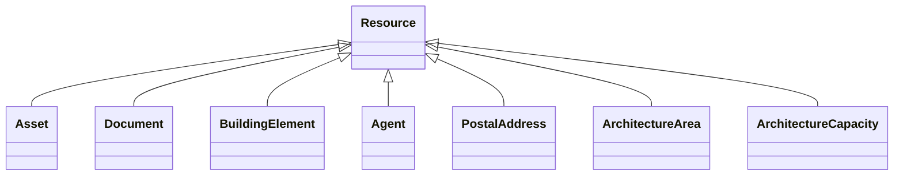

# Class: Resource 


_Base class for all resources_


URI: [rdfs:Resource](http://www.w3.org/2000/01/rdf-schema#Resource)





## Inheritance
* **Resource**
    * [Asset](Asset.md)
    * [Document](Document.md)
    * [BuildingElement](BuildingElement.md)
    * [Agent](Agent.md)
    * [PostalAddress](PostalAddress.md)
    * [ArchitectureArea](ArchitectureArea.md)
    * [ArchitectureCapacity](ArchitectureCapacity.md)


## Slots

| Name | Cardinality and Range | Description | Inheritance |
| ---  | --- | --- | --- |


## Usages

| used by | used in | type | used |
| ---  | --- | --- | --- |
| [Space](Space.md) | [hasPart](hasPart.md) | any_of[range] | [Resource](Resource.md) |
| [Space](Space.md) | [isPartOf](isPartOf.md) | any_of[range] | [Resource](Resource.md) |
| [Architecture](Architecture.md) | [area](area.md) | any_of[range] | [Resource](Resource.md) |
| [Architecture](Architecture.md) | [capacity](capacity.md) | any_of[range] | [Resource](Resource.md) |
| [Architecture](Architecture.md) | [address](address.md) | any_of[range] | [Resource](Resource.md) |
| [Architecture](Architecture.md) | [adjacentElement](adjacentElement.md) | any_of[range] | [Resource](Resource.md) |
| [Architecture](Architecture.md) | [architectedBy](architectedBy.md) | any_of[range] | [Resource](Resource.md) |
| [Architecture](Architecture.md) | [constructedBy](constructedBy.md) | any_of[range] | [Resource](Resource.md) |
| [Architecture](Architecture.md) | [containsElement](containsElement.md) | any_of[range] | [Resource](Resource.md) |
| [Architecture](Architecture.md) | [documentation](documentation.md) | any_of[range] | [Resource](Resource.md) |
| [Architecture](Architecture.md) | [intersectingElement](intersectingElement.md) | any_of[range] | [Resource](Resource.md) |
| [Architecture](Architecture.md) | [isFedBy](isFedBy.md) | range | [Resource](Resource.md) |
| [Architecture](Architecture.md) | [operatedBy](operatedBy.md) | any_of[range] | [Resource](Resource.md) |
| [Architecture](Architecture.md) | [ownedBy](ownedBy.md) | any_of[range] | [Resource](Resource.md) |
| [Architecture](Architecture.md) | [hasPart](hasPart.md) | any_of[range] | [Resource](Resource.md) |
| [Architecture](Architecture.md) | [isPartOf](isPartOf.md) | any_of[range] | [Resource](Resource.md) |
| [Site](Site.md) | [area](area.md) | any_of[range] | [Resource](Resource.md) |
| [Site](Site.md) | [capacity](capacity.md) | any_of[range] | [Resource](Resource.md) |
| [Site](Site.md) | [address](address.md) | any_of[range] | [Resource](Resource.md) |
| [Site](Site.md) | [adjacentElement](adjacentElement.md) | any_of[range] | [Resource](Resource.md) |
| [Site](Site.md) | [architectedBy](architectedBy.md) | any_of[range] | [Resource](Resource.md) |
| [Site](Site.md) | [constructedBy](constructedBy.md) | any_of[range] | [Resource](Resource.md) |
| [Site](Site.md) | [containsElement](containsElement.md) | any_of[range] | [Resource](Resource.md) |
| [Site](Site.md) | [documentation](documentation.md) | any_of[range] | [Resource](Resource.md) |
| [Site](Site.md) | [intersectingElement](intersectingElement.md) | any_of[range] | [Resource](Resource.md) |
| [Site](Site.md) | [isFedBy](isFedBy.md) | range | [Resource](Resource.md) |
| [Site](Site.md) | [operatedBy](operatedBy.md) | any_of[range] | [Resource](Resource.md) |
| [Site](Site.md) | [ownedBy](ownedBy.md) | any_of[range] | [Resource](Resource.md) |
| [Site](Site.md) | [hasPart](hasPart.md) | any_of[range] | [Resource](Resource.md) |
| [Site](Site.md) | [isPartOf](isPartOf.md) | any_of[range] | [Resource](Resource.md) |
| [Building](Building.md) | [area](area.md) | any_of[range] | [Resource](Resource.md) |
| [Building](Building.md) | [capacity](capacity.md) | any_of[range] | [Resource](Resource.md) |
| [Building](Building.md) | [address](address.md) | any_of[range] | [Resource](Resource.md) |
| [Building](Building.md) | [adjacentElement](adjacentElement.md) | any_of[range] | [Resource](Resource.md) |
| [Building](Building.md) | [architectedBy](architectedBy.md) | any_of[range] | [Resource](Resource.md) |
| [Building](Building.md) | [constructedBy](constructedBy.md) | any_of[range] | [Resource](Resource.md) |
| [Building](Building.md) | [containsElement](containsElement.md) | any_of[range] | [Resource](Resource.md) |
| [Building](Building.md) | [documentation](documentation.md) | any_of[range] | [Resource](Resource.md) |
| [Building](Building.md) | [intersectingElement](intersectingElement.md) | any_of[range] | [Resource](Resource.md) |
| [Building](Building.md) | [isFedBy](isFedBy.md) | range | [Resource](Resource.md) |
| [Building](Building.md) | [operatedBy](operatedBy.md) | any_of[range] | [Resource](Resource.md) |
| [Building](Building.md) | [ownedBy](ownedBy.md) | any_of[range] | [Resource](Resource.md) |
| [Building](Building.md) | [hasPart](hasPart.md) | any_of[range] | [Resource](Resource.md) |
| [Building](Building.md) | [isPartOf](isPartOf.md) | any_of[range] | [Resource](Resource.md) |
| [Level](Level.md) | [area](area.md) | any_of[range] | [Resource](Resource.md) |
| [Level](Level.md) | [capacity](capacity.md) | any_of[range] | [Resource](Resource.md) |
| [Level](Level.md) | [address](address.md) | any_of[range] | [Resource](Resource.md) |
| [Level](Level.md) | [adjacentElement](adjacentElement.md) | any_of[range] | [Resource](Resource.md) |
| [Level](Level.md) | [architectedBy](architectedBy.md) | any_of[range] | [Resource](Resource.md) |
| [Level](Level.md) | [constructedBy](constructedBy.md) | any_of[range] | [Resource](Resource.md) |
| [Level](Level.md) | [containsElement](containsElement.md) | any_of[range] | [Resource](Resource.md) |
| [Level](Level.md) | [documentation](documentation.md) | any_of[range] | [Resource](Resource.md) |
| [Level](Level.md) | [intersectingElement](intersectingElement.md) | any_of[range] | [Resource](Resource.md) |
| [Level](Level.md) | [isFedBy](isFedBy.md) | range | [Resource](Resource.md) |
| [Level](Level.md) | [operatedBy](operatedBy.md) | any_of[range] | [Resource](Resource.md) |
| [Level](Level.md) | [ownedBy](ownedBy.md) | any_of[range] | [Resource](Resource.md) |
| [Level](Level.md) | [hasPart](hasPart.md) | any_of[range] | [Resource](Resource.md) |
| [Level](Level.md) | [isPartOf](isPartOf.md) | any_of[range] | [Resource](Resource.md) |
| [Asset](Asset.md) | [commissionedBy](commissionedBy.md) | any_of[range] | [Resource](Resource.md) |
| [Asset](Asset.md) | [documentation](documentation.md) | any_of[range] | [Resource](Resource.md) |
| [Asset](Asset.md) | [hasPart](hasPart.md) | any_of[range] | [Resource](Resource.md) |
| [Asset](Asset.md) | [installedBy](installedBy.md) | any_of[range] | [Resource](Resource.md) |
| [Asset](Asset.md) | [isPartOf](isPartOf.md) | any_of[range] | [Resource](Resource.md) |
| [Asset](Asset.md) | [locatedIn](locatedIn.md) | range | [Resource](Resource.md) |
| [Asset](Asset.md) | [manufacturedBy](manufacturedBy.md) | any_of[range] | [Resource](Resource.md) |
| [Asset](Asset.md) | [mountedOn](mountedOn.md) | any_of[range] | [Resource](Resource.md) |
| [Asset](Asset.md) | [servicedBy](servicedBy.md) | any_of[range] | [Resource](Resource.md) |
| [Equipment](Equipment.md) | [feeds](feeds.md) | range | [Resource](Resource.md) |
| [Equipment](Equipment.md) | [isFedBy](isFedBy.md) | range | [Resource](Resource.md) |
| [Equipment](Equipment.md) | [commissionedBy](commissionedBy.md) | any_of[range] | [Resource](Resource.md) |
| [Equipment](Equipment.md) | [documentation](documentation.md) | any_of[range] | [Resource](Resource.md) |
| [Equipment](Equipment.md) | [hasPart](hasPart.md) | any_of[range] | [Resource](Resource.md) |
| [Equipment](Equipment.md) | [installedBy](installedBy.md) | any_of[range] | [Resource](Resource.md) |
| [Equipment](Equipment.md) | [isPartOf](isPartOf.md) | any_of[range] | [Resource](Resource.md) |
| [Equipment](Equipment.md) | [manufacturedBy](manufacturedBy.md) | any_of[range] | [Resource](Resource.md) |
| [Equipment](Equipment.md) | [mountedOn](mountedOn.md) | any_of[range] | [Resource](Resource.md) |
| [Equipment](Equipment.md) | [servicedBy](servicedBy.md) | any_of[range] | [Resource](Resource.md) |
| [BuildingElement](BuildingElement.md) | [documentation](documentation.md) | any_of[range] | [Resource](Resource.md) |
| [BuildingElement](BuildingElement.md) | [hasPart](hasPart.md) | any_of[range] | [Resource](Resource.md) |
| [BuildingElement](BuildingElement.md) | [isPartOf](isPartOf.md) | any_of[range] | [Resource](Resource.md) |
| [BuildingElement](BuildingElement.md) | [locatedIn](locatedIn.md) | range | [Resource](Resource.md) |
| [Agent](Agent.md) | [isMemberOf](isMemberOf.md) | any_of[range] | [Resource](Resource.md) |
| [Agent](Agent.md) | [owns](owns.md) | range | [Resource](Resource.md) |
| [Organization](Organization.md) | [isMemberOf](isMemberOf.md) | any_of[range] | [Resource](Resource.md) |
| [Organization](Organization.md) | [owns](owns.md) | range | [Resource](Resource.md) |


## Identifier and Mapping Information


### Schema Source


* from schema: https://www.sbco.or.jp/ont/schema


## Mappings

| Mapping Type | Mapped Value |
| ---  | ---  |
| self | rdfs:Resource |
| native | sbco:Resource |


## LinkML Source

<!-- TODO: investigate https://stackoverflow.com/questions/37606292/how-to-create-tabbed-code-blocks-in-mkdocs-or-sphinx -->

### Direct

<details>
```yaml
name: Resource
description: Base class for all resources
from_schema: https://www.sbco.or.jp/ont/schema
class_uri: rdfs:Resource

```
</details>

### Induced

<details>
```yaml
name: Resource
description: Base class for all resources
from_schema: https://www.sbco.or.jp/ont/schema
class_uri: rdfs:Resource

```
</details>