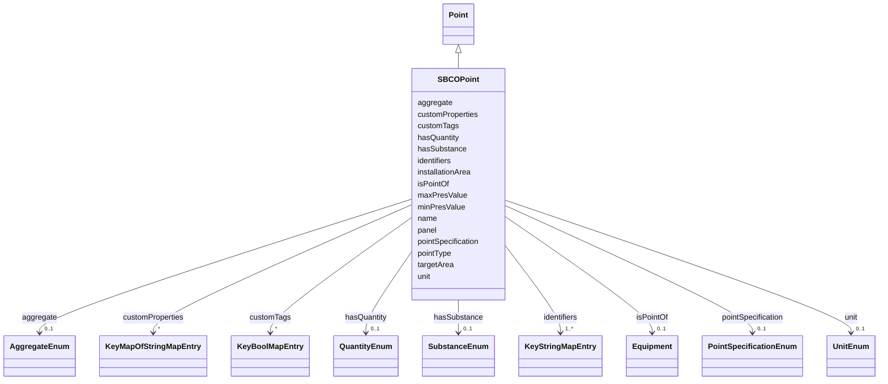

# Class: SBCOPoint 


_A point (sensor/actuator) in a smart building context._


URI: [sbco:SBCOPoint](https://www.sbco.or.jp/ont/SBCOPoint)





## Inheritance
* [Point](Point.md)
    * **SBCOPoint**


## Slots

| Name | Cardinality and Range | Description | Inheritance |
| ---  | --- | --- | --- |
| [installationArea](installationArea.md) | 0..1 <br/> [String](String.md) | Parent installation area | direct |
| [targetArea](targetArea.md) | 0..1 <br/> [String](String.md) | Target area for this resource | direct |
| [panel](panel.md) | 0..1 <br/> [String](String.md) | Parent panel | direct |
| [pointSpecification](pointSpecification.md) | 0..1 <br/> [PointSpecificationEnum](PointSpecificationEnum.md) | Point specification category as shown in equipment point list | direct |
| [pointType](pointType.md) | 1 <br/> [String](String.md) | Point type - a profile or template name used to refer to the telemetry format... | direct |
| [unit](unit.md) | 0..1 <br/> [UnitEnum](UnitEnum.md) | Measurement unit (enum key; symbol can be taken from annotations) | direct |
| [maxPresValue](maxPresValue.md) | 0..1 <br/> [Float](Float.md) | Maximum plausible reading | direct |
| [minPresValue](minPresValue.md) | 0..1 <br/> [Float](Float.md) | Minimum plausible reading | direct |
| [isPointOf](isPointOf.md) | 0..1 <br/> [Equipment](Equipment.md) | Equipment that this point belongs to | [Point](Point.md) |
| [aggregate](aggregate.md) | 0..1 <br/> [AggregateEnum](AggregateEnum.md) | Aggregation function or method for point data processing | [Point](Point.md) |
| [customProperties](customProperties.md) | * <br/> [KeyMapOfStringMapEntry](KeyMapOfStringMapEntry.md) | map(string -> map(string -> string)) | [Point](Point.md) |
| [customTags](customTags.md) | * <br/> [KeyBoolMapEntry](KeyBoolMapEntry.md) | map(string -> boolean) | [Point](Point.md) |
| [hasQuantity](hasQuantity.md) | 0..1 <br/> [QuantityEnum](QuantityEnum.md) | Physical quantity measured by this point | [Point](Point.md) |
| [hasSubstance](hasSubstance.md) | 0..1 <br/> [SubstanceEnum](SubstanceEnum.md) | Substance associated with this point | [Point](Point.md) |
| [identifiers](identifiers.md) | 1..* <br/> [KeyStringMapEntry](KeyStringMapEntry.md) | map(string -> string) | [Point](Point.md) |
| [name](name.md) | 1 <br/> [String](String.md) | Machine or Human-readable name | [Point](Point.md) |


## Identifier and Mapping Information


### Annotations

| property | value |
| --- | --- |
| description_ja | スマートビルディングの文脈におけるポイント（センサー/アクチュエータ）。 |


### Schema Source


* from schema: https://www.sbco.or.jp/ont/schema


## Mappings

| Mapping Type | Mapped Value |
| ---  | ---  |
| self | sbco:SBCOPoint |
| native | sbco:SBCOPoint |


## LinkML Source

<!-- TODO: investigate https://stackoverflow.com/questions/37606292/how-to-create-tabbed-code-blocks-in-mkdocs-or-sphinx -->

### Direct

<details>
```yaml
name: SBCOPoint
annotations:
  description_ja:
    tag: description_ja
    value: スマートビルディングの文脈におけるポイント（センサー/アクチュエータ）。
description: A point (sensor/actuator) in a smart building context.
from_schema: https://www.sbco.or.jp/ont/schema
is_a: Point
slots:
- installationArea
- targetArea
- panel
- pointSpecification
- pointType
- unit
- maxPresValue
- minPresValue
slot_usage:
  isPointOf:
    name: isPointOf
    range: Equipment
class_uri: sbco:SBCOPoint

```
</details>

### Induced

<details>
```yaml
name: SBCOPoint
annotations:
  description_ja:
    tag: description_ja
    value: スマートビルディングの文脈におけるポイント（センサー/アクチュエータ）。
description: A point (sensor/actuator) in a smart building context.
from_schema: https://www.sbco.or.jp/ont/schema
is_a: Point
slot_usage:
  isPointOf:
    name: isPointOf
    range: Equipment
attributes:
  installationArea:
    name: installationArea
    description: Parent installation area
    from_schema: https://www.sbco.or.jp/ont/schema
    rank: 1000
    alias: installationArea
    owner: SBCOPoint
    domain_of:
    - SBCOPoint
    range: string
  targetArea:
    name: targetArea
    description: Target area for this resource
    from_schema: https://www.sbco.or.jp/ont/schema
    rank: 1000
    alias: targetArea
    owner: SBCOPoint
    domain_of:
    - SBCOPoint
    range: string
  panel:
    name: panel
    description: Parent panel
    from_schema: https://www.sbco.or.jp/ont/schema
    rank: 1000
    alias: panel
    owner: SBCOPoint
    domain_of:
    - SBCOPoint
    range: string
  pointSpecification:
    name: pointSpecification
    annotations:
      description_ja:
        tag: description_ja
        value: 設備のポイントリストで示される、ポイントの区分を明示。
    description: Point specification category as shown in equipment point list. English
      is recommended.
    from_schema: https://www.sbco.or.jp/ont/schema
    rank: 1000
    alias: pointSpecification
    owner: SBCOPoint
    domain_of:
    - SBCOPoint
    range: PointSpecificationEnum
  pointType:
    name: pointType
    annotations:
      description_ja:
        tag: description_ja
        value: ポイントタイプ - 機器やポイントから取得できるテレメトリのフォーマットを参照するためのプロファイル名、またはテンプレート名。具体的な定義については、スキーマファイル等で当該タイプについては別途定義される。
    description: Point type - a profile or template name used to refer to the telemetry
      format obtainable from the device or point. Specific definitions are provided
      separately in schema files.
    from_schema: https://www.sbco.or.jp/ont/schema
    rank: 1000
    alias: pointType
    owner: SBCOPoint
    domain_of:
    - SBCOPoint
    range: string
    required: true
  unit:
    name: unit
    description: Measurement unit (enum key; symbol can be taken from annotations)
    from_schema: https://www.sbco.or.jp/ont/schema
    rank: 1000
    alias: unit
    owner: SBCOPoint
    domain_of:
    - SBCOPoint
    range: UnitEnum
  maxPresValue:
    name: maxPresValue
    description: Maximum plausible reading
    from_schema: https://www.sbco.or.jp/ont/schema
    rank: 1000
    alias: maxPresValue
    owner: SBCOPoint
    domain_of:
    - SBCOPoint
    range: float
  minPresValue:
    name: minPresValue
    description: Minimum plausible reading
    from_schema: https://www.sbco.or.jp/ont/schema
    rank: 1000
    alias: minPresValue
    owner: SBCOPoint
    domain_of:
    - SBCOPoint
    range: float
  isPointOf:
    name: isPointOf
    annotations:
      description_ja:
        tag: description_ja
        value: このポイントが属する設備
    description: Equipment that this point belongs to
    from_schema: https://www.sbco.or.jp/ont/schema
    rank: 1000
    slot_uri: brick:isPointOf
    alias: isPointOf
    owner: SBCOPoint
    domain_of:
    - Point
    range: Equipment
  aggregate:
    name: aggregate
    annotations:
      description_ja:
        tag: description_ja
        value: ポイントデータ処理のための集約関数または方法
      azure_dtdl_type:
        tag: azure_dtdl_type
        value: DTObjectInfo
    description: Aggregation function or method for point data processing
    from_schema: https://www.sbco.or.jp/ont/schema
    rank: 1000
    slot_uri: brick:aggregate
    alias: aggregate
    owner: SBCOPoint
    domain_of:
    - Point
    range: AggregateEnum
  customProperties:
    name: customProperties
    description: map(string -> map(string -> string))
    from_schema: https://www.sbco.or.jp/ont/schema
    rank: 1000
    slot_uri: rec:customProperties
    alias: customProperties
    owner: SBCOPoint
    domain_of:
    - Space
    - Asset
    - Point
    - Agent
    - PostalAddress
    range: KeyMapOfStringMapEntry
    multivalued: true
    inlined: true
    inlined_as_list: true
  customTags:
    name: customTags
    description: map(string -> boolean)
    from_schema: https://www.sbco.or.jp/ont/schema
    rank: 1000
    slot_uri: rec:customTags
    alias: customTags
    owner: SBCOPoint
    domain_of:
    - Space
    - Asset
    - Point
    - BuildingElement
    - Agent
    - PostalAddress
    range: KeyBoolMapEntry
    multivalued: true
    inlined: true
    inlined_as_list: true
  hasQuantity:
    name: hasQuantity
    annotations:
      description_ja:
        tag: description_ja
        value: このポイントで測定される物理量
    description: Physical quantity measured by this point
    from_schema: https://www.sbco.or.jp/ont/schema
    rank: 1000
    slot_uri: brick:hasQuantity
    alias: hasQuantity
    owner: SBCOPoint
    domain_of:
    - Point
    range: QuantityEnum
  hasSubstance:
    name: hasSubstance
    annotations:
      description_ja:
        tag: description_ja
        value: このポイントに関連する物質
    description: Substance associated with this point
    from_schema: https://www.sbco.or.jp/ont/schema
    rank: 1000
    slot_uri: brick:hasSubstance
    alias: hasSubstance
    owner: SBCOPoint
    domain_of:
    - Point
    range: SubstanceEnum
  identifiers:
    name: identifiers
    description: map(string -> string)
    from_schema: https://www.sbco.or.jp/ont/schema
    rank: 1000
    slot_uri: rec:identifiers
    alias: identifiers
    owner: SBCOPoint
    domain_of:
    - Space
    - Asset
    - Point
    - BuildingElement
    - Agent
    - PostalAddress
    range: KeyStringMapEntry
    required: true
    multivalued: true
    inlined: true
    inlined_as_list: true
  name:
    name: name
    description: Machine or Human-readable name
    from_schema: https://www.sbco.or.jp/ont/schema
    rank: 1000
    slot_uri: rec:name
    alias: name
    owner: SBCOPoint
    domain_of:
    - Space
    - Asset
    - Point
    - BuildingElement
    - Agent
    - PostalAddress
    range: string
    required: true
class_uri: sbco:SBCOPoint

```
</details>