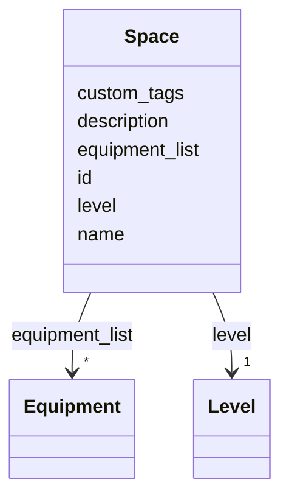

# Class: Space 


_A space (room or area) within a level._


URI: [ex:Space](https://example.org/onto/Space)





<!-- no inheritance hierarchy -->


## Slots

| Name | Cardinality and Range | Description | Inheritance |
| ---  | --- | --- | --- |
| [id](id.md) | 1 <br/> [String](String.md) | A unique identifier (URI, GUID, or local id) | direct |
| [name](name.md) | 1 <br/> [String](String.md) | Human-readable name | direct |
| [description](description.md) | 0..1 <br/> [String](String.md) |  | direct |
| [custom_tags](custom_tags.md) | * <br/> [String](String.md) | Free-form tags | direct |
| [level](level.md) | 1 <br/> [Level](Level.md) | Level this space is on | direct |
| [equipment_list](equipment_list.md) | * <br/> [Equipment](Equipment.md) | Equipment installed in this space | direct |


## Usages

| used by | used in | type | used |
| ---  | --- | --- | --- |
| [Level](Level.md) | [spaces](spaces.md) | range | [Space](Space.md) |
| [Equipment](Equipment.md) | [installed_in](installed_in.md) | range | [Space](Space.md) |


## Identifier and Mapping Information


### Schema Source


* from schema: https://example.org/building-model


## Mappings

| Mapping Type | Mapped Value |
| ---  | ---  |
| self | ex:Space |
| native | ex:Space |


## LinkML Source

<!-- TODO: investigate https://stackoverflow.com/questions/37606292/how-to-create-tabbed-code-blocks-in-mkdocs-or-sphinx -->

### Direct

<details>
```yaml
name: Space
description: A space (room or area) within a level.
from_schema: https://example.org/building-model
slots:
- id
- name
- description
- custom_tags
- level
- equipment_list

```
</details>

### Induced

<details>
```yaml
name: Space
description: A space (room or area) within a level.
from_schema: https://example.org/building-model
attributes:
  id:
    name: id
    description: A unique identifier (URI, GUID, or local id)
    from_schema: https://example.org/building-model
    rank: 1000
    identifier: true
    alias: id
    owner: Space
    domain_of:
    - Site
    - Building
    - Level
    - Space
    - Equipment
    - Point
    - Campus
    range: string
    required: true
  name:
    name: name
    description: Human-readable name
    from_schema: https://example.org/building-model
    rank: 1000
    alias: name
    owner: Space
    domain_of:
    - Site
    - Building
    - Level
    - Space
    - Equipment
    - Point
    - Campus
    range: string
    required: true
  description:
    name: description
    from_schema: https://example.org/building-model
    rank: 1000
    alias: description
    owner: Space
    domain_of:
    - Site
    - Building
    - Level
    - Space
    - Equipment
    - Point
    - Campus
    range: string
    required: false
  custom_tags:
    name: custom_tags
    description: Free-form tags
    from_schema: https://example.org/building-model
    rank: 1000
    alias: custom_tags
    owner: Space
    domain_of:
    - Site
    - Building
    - Level
    - Space
    - Equipment
    - Point
    range: string
    multivalued: true
    inlined: true
    inlined_as_list: true
  level:
    name: level
    description: Level this space is on
    from_schema: https://example.org/building-model
    rank: 1000
    alias: level
    owner: Space
    domain_of:
    - Space
    range: Level
    required: true
  equipment_list:
    name: equipment_list
    description: Equipment installed in this space
    from_schema: https://example.org/building-model
    rank: 1000
    alias: equipment_list
    owner: Space
    domain_of:
    - Space
    range: Equipment
    multivalued: true
    inlined: true
    inlined_as_list: true

```
</details>