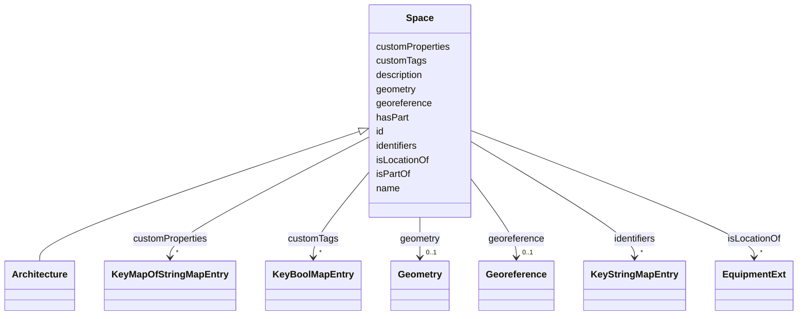

# Class: Space 


_A contiguous part of the physical world that contains or can contain sub-spaces. E.g., a Region can contain many Sites, which in turn can contain many Buildings._


URI: [rec:Space](https://w3id.org/rec/Space)





## Inheritance
* **Space**
    * [Architecture](Architecture.md)


## Slots

| Name | Cardinality and Range | Description | Inheritance |
| ---  | --- | --- | --- |
| [id](id.md) | 1 <br/> [String](String.md) | Unique identifier within the schema | direct |
| [geometry](geometry.md) | 0..1 <br/> [Geometry](Geometry.md) | Polygon representing the spatial extent of this Space | direct |
| [georeference](georeference.md) | 0..1 <br/> [Georeference](Georeference.md) | A georeference creates a relationship between the local coordinate system use... | direct |
| [hasPart](hasPart.md) | * <br/> [Any](Any.md)&nbsp;or&nbsp;<br />[Space](Space.md)&nbsp;or&nbsp;<br />[Site](Site.md)&nbsp;or&nbsp;<br />[Building](Building.md)&nbsp;or&nbsp;<br />[Level](Level.md)&nbsp;or&nbsp;<br />[Room](Room.md)&nbsp;or&nbsp;<br />[Zone](Zone.md)&nbsp;or&nbsp;<br />[OutdoorSpace](OutdoorSpace.md) | The subject is composed in part of the entity given by the object | direct |
| [isLocationOf](isLocationOf.md) | * <br/> [EquipmentExt](EquipmentExt.md) | Subject is the physical location encapsulating the object | direct |
| [isPartOf](isPartOf.md) | 0..1 <br/> [Any](Any.md)&nbsp;or&nbsp;<br />[Space](Space.md)&nbsp;or&nbsp;<br />[Site](Site.md)&nbsp;or&nbsp;<br />[Building](Building.md)&nbsp;or&nbsp;<br />[Level](Level.md)&nbsp;or&nbsp;<br />[Room](Room.md)&nbsp;or&nbsp;<br />[Zone](Zone.md)&nbsp;or&nbsp;<br />[OutdoorSpace](OutdoorSpace.md) |  | direct |
| [customProperties](customProperties.md) | * <br/> [KeyMapOfStringMapEntry](KeyMapOfStringMapEntry.md) | map(string -> map(string -> string)) | direct |
| [customTags](customTags.md) | * <br/> [KeyBoolMapEntry](KeyBoolMapEntry.md) | map(string -> boolean) | direct |
| [identifiers](identifiers.md) | * <br/> [KeyStringMapEntry](KeyStringMapEntry.md) | map(string -> string) | direct |
| [name](name.md) | 1 <br/> [String](String.md) | Machine or Human-readable name | direct |
| [description](description.md) | 0..1 <br/> [String](String.md) | A textual description of the resource | direct |


## Usages

| used by | used in | type | used |
| ---  | --- | --- | --- |
| [Space](Space.md) | [hasPart](hasPart.md) | any_of[range] | [Space](Space.md) |
| [Space](Space.md) | [isPartOf](isPartOf.md) | any_of[range] | [Space](Space.md) |
| [Architecture](Architecture.md) | [hasPart](hasPart.md) | any_of[range] | [Space](Space.md) |
| [Architecture](Architecture.md) | [isPartOf](isPartOf.md) | any_of[range] | [Space](Space.md) |
| [Site](Site.md) | [hasPart](hasPart.md) | any_of[range] | [Space](Space.md) |
| [Site](Site.md) | [isPartOf](isPartOf.md) | any_of[range] | [Space](Space.md) |
| [Building](Building.md) | [hasPart](hasPart.md) | any_of[range] | [Space](Space.md) |
| [Building](Building.md) | [isPartOf](isPartOf.md) | any_of[range] | [Space](Space.md) |
| [Level](Level.md) | [hasPart](hasPart.md) | any_of[range] | [Space](Space.md) |
| [Level](Level.md) | [isPartOf](isPartOf.md) | any_of[range] | [Space](Space.md) |
| [Room](Room.md) | [hasPart](hasPart.md) | any_of[range] | [Space](Space.md) |
| [Room](Room.md) | [isPartOf](isPartOf.md) | any_of[range] | [Space](Space.md) |
| [Zone](Zone.md) | [hasPart](hasPart.md) | any_of[range] | [Space](Space.md) |
| [Zone](Zone.md) | [isPartOf](isPartOf.md) | any_of[range] | [Space](Space.md) |
| [OutdoorSpace](OutdoorSpace.md) | [hasPart](hasPart.md) | any_of[range] | [Space](Space.md) |
| [OutdoorSpace](OutdoorSpace.md) | [isPartOf](isPartOf.md) | any_of[range] | [Space](Space.md) |
| [Asset](Asset.md) | [hasPart](hasPart.md) | any_of[range] | [Space](Space.md) |
| [Asset](Asset.md) | [isPartOf](isPartOf.md) | any_of[range] | [Space](Space.md) |
| [Asset](Asset.md) | [locatedIn](locatedIn.md) | any_of[range] | [Space](Space.md) |
| [Equipment](Equipment.md) | [hasPart](hasPart.md) | any_of[range] | [Space](Space.md) |
| [Equipment](Equipment.md) | [isPartOf](isPartOf.md) | any_of[range] | [Space](Space.md) |
| [Equipment](Equipment.md) | [locatedIn](locatedIn.md) | any_of[range] | [Space](Space.md) |
| [EquipmentExt](EquipmentExt.md) | [hasPart](hasPart.md) | any_of[range] | [Space](Space.md) |
| [EquipmentExt](EquipmentExt.md) | [isPartOf](isPartOf.md) | any_of[range] | [Space](Space.md) |
| [EquipmentExt](EquipmentExt.md) | [locatedIn](locatedIn.md) | any_of[range] | [Space](Space.md) |


## Identifier and Mapping Information


### Annotations

| property | value |
| --- | --- |
| description_ja | 室やゾーンなどの空間単位。設備を含みうる。 |


### Schema Source


* from schema: https://www.sbco.or.jp/ont/schema


## Mappings

| Mapping Type | Mapped Value |
| ---  | ---  |
| self | rec:Space |
| native | sbco:Space |
| exact | rec:Space |


## LinkML Source

<!-- TODO: investigate https://stackoverflow.com/questions/37606292/how-to-create-tabbed-code-blocks-in-mkdocs-or-sphinx -->

### Direct

<details>
```yaml
name: Space
annotations:
  description_ja:
    tag: description_ja
    value: 室やゾーンなどの空間単位。設備を含みうる。
description: A contiguous part of the physical world that contains or can contain
  sub-spaces. E.g., a Region can contain many Sites, which in turn can contain many
  Buildings.
from_schema: https://www.sbco.or.jp/ont/schema
exact_mappings:
- rec:Space
slots:
- id
- geometry
- georeference
- hasPart
- isLocationOf
- isPartOf
- customProperties
- customTags
- identifiers
- name
- description
class_uri: rec:Space

```
</details>

### Induced

<details>
```yaml
name: Space
annotations:
  description_ja:
    tag: description_ja
    value: 室やゾーンなどの空間単位。設備を含みうる。
description: A contiguous part of the physical world that contains or can contain
  sub-spaces. E.g., a Region can contain many Sites, which in turn can contain many
  Buildings.
from_schema: https://www.sbco.or.jp/ont/schema
exact_mappings:
- rec:Space
attributes:
  id:
    name: id
    annotations:
      description_ja:
        tag: description_ja
        value: スキーマ内の一意識別子。文字で開始し、DTMI形式もサポート。
      example:
        tag: example
        value: dtmi:example:Building:1
    description: Unique identifier within the schema. Must start with a letter and
      contain only letters, digits, underscores, hyphens, colons, semicolons, or periods.
      DTMI is one acceptable example.
    from_schema: https://www.sbco.or.jp/ont/schema
    rank: 1000
    identifier: true
    alias: id
    owner: Space
    domain_of:
    - Space
    - Asset
    - Point
    - Agent
    - Organization
    - BuildingElement
    - ArchitectureArea
    - ArchitectureCapacity
    range: string
    required: true
  geometry:
    name: geometry
    description: Polygon representing the spatial extent of this Space.
    from_schema: https://www.sbco.or.jp/ont/schema
    rank: 1000
    slot_uri: rec:geometry
    alias: geometry
    owner: Space
    domain_of:
    - Space
    - Asset
    range: Geometry
    multivalued: false
  georeference:
    name: georeference
    description: A georeference creates a relationship between the local coordinate
      system used within a building (e.g., measured in meters) and a geographic coordinate
      system (e.g., lat, long, alt), such that locally placed Spaces can be resolved
      and rendered in that geographic coordinate system (e.g., for mapping purposes).
    from_schema: https://www.sbco.or.jp/ont/schema
    rank: 1000
    slot_uri: rec:georeference
    alias: georeference
    owner: Space
    domain_of:
    - Space
    range: Georeference
    multivalued: false
  hasPart:
    name: hasPart
    description: The subject is composed in part of the entity given by the object.
    from_schema: https://www.sbco.or.jp/ont/schema
    rank: 1000
    slot_uri: rec:hasPart
    alias: hasPart
    owner: Space
    domain_of:
    - Space
    - Asset
    range: Any
    multivalued: true
    any_of:
    - range: Space
    - range: Site
    - range: Building
    - range: Level
    - range: Room
    - range: Zone
    - range: OutdoorSpace
  isLocationOf:
    name: isLocationOf
    description: Subject is the physical location encapsulating the object.
    from_schema: https://www.sbco.or.jp/ont/schema
    rank: 1000
    slot_uri: rec:isLocationOf
    alias: isLocationOf
    owner: Space
    domain_of:
    - Space
    range: EquipmentExt
    multivalued: true
  isPartOf:
    name: isPartOf
    from_schema: https://www.sbco.or.jp/ont/schema
    rank: 1000
    slot_uri: rec:isPartOf
    alias: isPartOf
    owner: Space
    domain_of:
    - Space
    - Asset
    range: Any
    multivalued: false
    any_of:
    - range: Space
    - range: Site
    - range: Building
    - range: Level
    - range: Room
    - range: Zone
    - range: OutdoorSpace
  customProperties:
    name: customProperties
    description: map(string -> map(string -> string))
    from_schema: https://www.sbco.or.jp/ont/schema
    rank: 1000
    slot_uri: rec:customProperties
    alias: customProperties
    owner: Space
    domain_of:
    - Space
    - Asset
    - Point
    - Information
    - PostalAddress
    - Agent
    - Organization
    - BuildingElement
    - ArchitectureArea
    - ArchitectureCapacity
    range: KeyMapOfStringMapEntry
    multivalued: true
    inlined: true
    inlined_as_list: true
  customTags:
    name: customTags
    description: map(string -> boolean)
    from_schema: https://www.sbco.or.jp/ont/schema
    rank: 1000
    slot_uri: rec:customTags
    alias: customTags
    owner: Space
    domain_of:
    - Space
    - Asset
    - Point
    - Information
    - PostalAddress
    - Agent
    - Organization
    - BuildingElement
    - ArchitectureArea
    - ArchitectureCapacity
    range: KeyBoolMapEntry
    multivalued: true
    inlined: true
    inlined_as_list: true
  identifiers:
    name: identifiers
    description: map(string -> string)
    from_schema: https://www.sbco.or.jp/ont/schema
    rank: 1000
    slot_uri: rec:identifiers
    alias: identifiers
    owner: Space
    domain_of:
    - Space
    - Asset
    - Point
    - Information
    - PostalAddress
    - Agent
    - Organization
    - BuildingElement
    - ArchitectureArea
    - ArchitectureCapacity
    range: KeyStringMapEntry
    required: false
    multivalued: true
    inlined: true
    inlined_as_list: true
  name:
    name: name
    description: Machine or Human-readable name
    from_schema: https://www.sbco.or.jp/ont/schema
    rank: 1000
    slot_uri: rec:name
    alias: name
    owner: Space
    domain_of:
    - Space
    - Asset
    - Point
    - Information
    - PostalAddress
    - Agent
    - Organization
    - BuildingElement
    - ArchitectureArea
    - ArchitectureCapacity
    range: string
    required: true
  description:
    name: description
    annotations:
      description_ja:
        tag: description_ja
        value: リソースのテキスト記述
    description: A textual description of the resource
    from_schema: https://www.sbco.or.jp/ont/schema
    rank: 1000
    slot_uri: rec:description
    alias: description
    owner: Space
    domain_of:
    - Space
    - Asset
    - Information
    range: string
class_uri: rec:Space

```
</details>